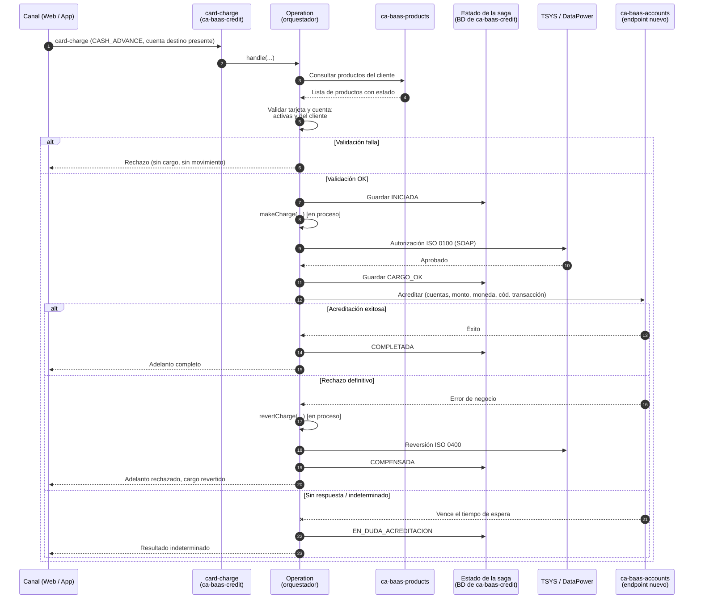
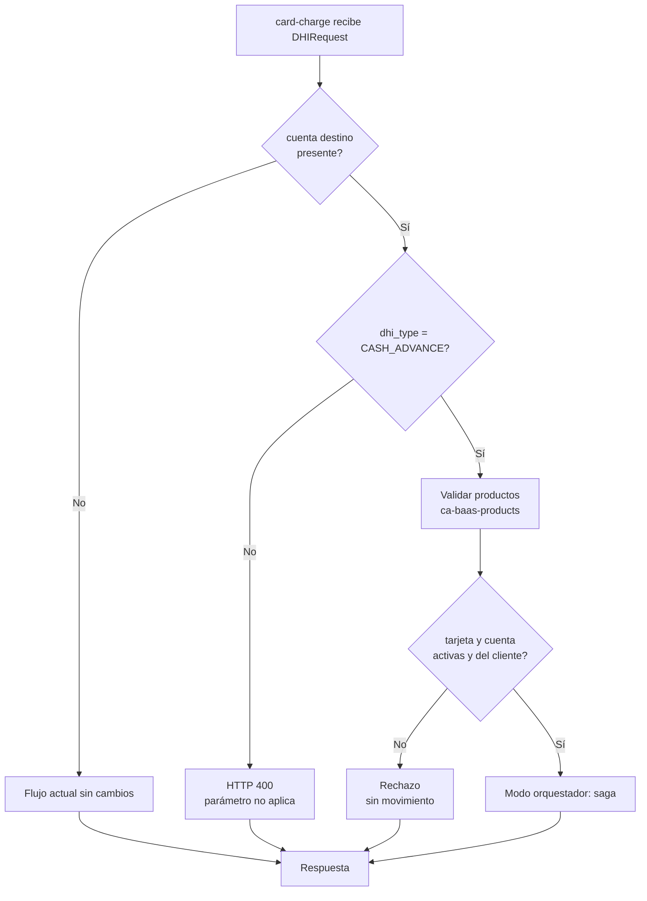
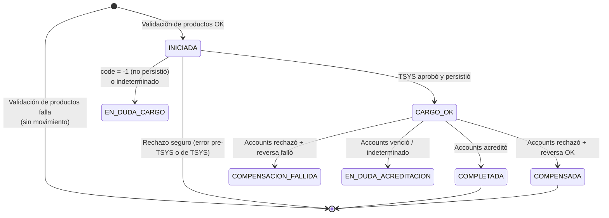

# ADR-0XX: Avance de Efectivo — orquestación en `card-charge` consumiendo un endpoint nuevo de `ca-baas-accounts`, con validación previa de productos

**Tipo:** ADR (Registro de Decisión Arquitectónica)
**Fecha de creación:** 2026-07-08
**Última actualización:** 2026-07-11
**Autor:** Álvaro — Equipo CCA / `ca-baas-credit`
**Participantes de la decisión:** dos Tech Leads, un Arquitecto, la Gerencia, equipo de `ca-baas-accounts`
**Estado:** 🟢 **Aceptada — Opción F.** (Las Opciones A–E fueron evaluadas; se conserva el registro histórico abajo.)

---

## TL;DR

Se implementa el Avance de Efectivo con tres microservicios coordinados:

1. **`ca-baas-credit`** modifica su endpoint `POST /v1/credit/card-charge`, agregando un parámetro opcional de **cuenta destino**. Cuando viene, la Operation actúa como **orquestador** de una saga: valida productos, carga la tarjeta y solicita la acreditación.
2. **`ca-baas-accounts`** expone un **endpoint nuevo** que recibe parámetros mínimos de transferencia (cuentas, monto, moneda) y resuelve internamente los parámetros de comunicación con SProBaaS (código de operación, formato ETF, etc.) a partir de una tabla de parametrización. Ese endpoint reutiliza internamente la lógica de `transfers-between-accounts`.
3. **`ca-baas-products`** se consulta **antes** de cargar la tarjeta, para validar que la cuenta y la tarjeta están activas y pertenecen al cliente del request.

Credit **ya no llama a SProBaaS** ni replica la lógica de acreditación. La compensación (`CASH_ADVANCE_REVERSE`) permanece en Credit.

## Contexto

### Del negocio

Esta funcionalidad es un **Gap** de la fusión de entidades bancarias en curso: una capacidad que ofrecía la entidad absorbida y que debe existir en la plataforma resultante. Forma parte de un **conjunto de Gaps**. Todos los Gaps críticos y de prioridad alta deben estar **en producción antes de la auditoría de febrero de 2027**. Dentro de ese conjunto, Negocio priorizó el Avance de Efectivo con fecha propia:

| Hito | Fecha |
|------|-------|
| UAT | Primera semana de agosto de 2026 |
| **Producción** | **Fin de agosto de 2026** |
| Auditoría del conjunto de Gaps | Febrero de 2027 |

La fecha de agosto es un compromiso de Negocio; el límite regulatorio es la auditoría de febrero de 2027. La planificación se hace contra agosto. Se consumirá desde canales de Plataforma Web y aplicaciones móviles.

### Del sistema

El Avance de Efectivo cruza dos dominios: **crédito** (cargo a la tarjeta, `ca-baas-credit` vía TSYS/DataPower) y **depósitos** (acreditación a la cuenta, vía el core **SProBaaS**). Intervienen cuatro microservicios:

| Microservicio | Rol en esta solución | Equipo |
|---------------|----------------------|--------|
| `ca-baas-credit` | Orquestador. Cargo y compensación a la tarjeta. | CCA (nuestro) |
| `ca-baas-accounts` | Acreditación a la cuenta. Expone el endpoint nuevo. | Otro negocio |
| `ca-baas-products` | Validación de productos del cliente (tarjeta y cuenta activas y de su propiedad). | Otro |
| `ca-baas-configuration` | Alberga la tabla de parametrización de la comunicación con SProBaaS (código de operación, formato ETF, por código de transacción y moneda). Consumido **internamente por Accounts**, no por Credit. | Otro |

## Evolución de la solución de acreditación

El diseño de la pata de acreditación pasó por tres formas. Se documentan las tres porque el ADR es la memoria de la decisión.

1. **Opción D (rechazada):** Credit consume directamente `transfers-between-accounts` de Accounts. Rechazada por el riesgo de tener que modificar y **re-certificar** ese endpoint, que ya tiene consumers en producción.
2. **Opción E (superada):** Credit llama directamente a SProBaaS y replica la lógica de acreditación. Superada porque duplicaba lógica de movimiento de dinero, sumaba superficie PCI a Credit y exigía un nuevo camino de red Credit→SProBaaS.
3. **Opción F (adoptada):** Accounts expone un **endpoint nuevo**, fachada sobre `transfers-between-accounts`, con contrato mínimo. Credit lo consume. Resuelve simultáneamente las objeciones de D y E.

### Por qué la Opción F es superior a D y E

- **No re-certifica los canales existentes.** El endpoint `transfers-between-accounts` no se toca; el endpoint nuevo es aditivo. Los consumers actuales no se ven afectados. (Esta era la objeción principal contra la Opción D.)
- **No duplica lógica de movimiento de dinero en Credit** ni le agrega dependencia con SProBaaS. (Esta era la objeción principal contra la Opción E.)
- **Respeta el bounded context original.** La acreditación y el conocimiento de SProBaaS quedan en el dominio de depósitos.
- **Reutilizable para otros Gaps.** Se anticipa que otros Gaps necesitarán comunicación con ETF5000; el endpoint nuevo queda disponible para ellos.
- **Abstrae la complejidad de SProBaaS.** El contrato del endpoint nuevo recibe solo parámetros de negocio (cuentas, monto, moneda); los parámetros técnicos de SProBaaS se resuelven desde la tabla de `ca-baas-configuration`.

## Decisión adoptada — Opción F

### En `ca-baas-credit`

Modificar `POST /v1/credit/card-charge`:

1. **Contrato:** agregar al `DHIRequest` un campo opcional de **cuenta destino**. Campo nuevo y opcional → **compatible hacia atrás**.
2. **Comportamiento:**
   - `dhi_type = CASH_ADVANCE` **y** cuenta destino presente → modo **orquestador** (saga).
   - Cuenta destino ausente → comportamiento actual, sin cambio.
   - Cuenta destino presente con otro `dhi_type` → `HTTP 400`.
3. **Punto único de bifurcación.** La decisión de modo se toma en un solo lugar. La lógica nueva (validación de productos y llamada al endpoint de Accounts) vive en **colaboradores inyectados**, no dentro de `PostDHIAuthorizationOperation`.
4. **Compensación:** ante fallo definitivo de la acreditación, se invoca `revertCharge` en proceso con el mismo `reference_number`.

### En `ca-baas-accounts` (responsabilidad del otro equipo)

Endpoint nuevo, fachada sobre `transfers-between-accounts`, que:
- Recibe parámetros mínimos: cuenta origen, cuenta destino, monto, moneda, código de transacción.
- Resuelve internamente, contra la tabla de `ca-baas-configuration` (por código de transacción y moneda), los parámetros técnicos de SProBaaS (código de operación, formato ETF, códigos de razón).
- Reutiliza la lógica existente de acreditación.

> ℹ️ El diseño interno de este endpoint no es responsabilidad de `ca-baas-credit`, pero su contrato y su comportamiento de error sí son una dependencia. Ver Dependencias.

### Flujo de validación previa

Antes de cargar la tarjeta en TSYS —y por lo tanto antes de cualquier movimiento de dinero— el orquestador consulta **`ca-baas-products`** con el identificador del cliente del request. El servicio devuelve todos los productos del cliente con su estado (activo/inactivo). El orquestador valida:

- La **tarjeta** (por `card_key`) está en la lista y su estado es **activo**.
- La **cuenta destino** está en la lista y su estado es **activo**.
- Ambos productos **pertenecen al cliente** del request (por estar presentes en la respuesta de ese cliente).

Si cualquier validación falla → se rechaza la solicitud **antes** del cargo. Sin movimiento de dinero, sin compensación.

## Diagrama de la saga adoptada

> 💡 Si Confluence no renderiza Mermaid, exportar a PNG. La fuente queda como comentario para mantenimiento.

**Nota de lectura.** La validación de productos (pasos 3-5) ocurre **antes** de cualquier movimiento de dinero: es la barrera más barata. El cargo a la tarjeta (paso 8) y la acreditación (paso 12) son los dos únicos pasos con dinero de por medio; entre ambos se persiste `CARGO_OK` para que la compensación sea siempre posible.

## Modo de operación bifurcado

## Evidencia relevante del código (se conserva de análisis previos)

### `ca-baas-credit` (`card-charge`)

| # | Hallazgo | Vigencia en la Opción F |
|---|----------|-------------------------|
| C1 | `PostDHIAuthorizationOperation` es un `@Service` con único método público `handle(...)`; el resto es privado | La orquestación vive dentro de la clase, con colaboradores inyectados. |
| C2 | `executeDHIAuthorization` despacha por `dhi_type`: `CASH_ADVANCE` → `makeCharge`; `CASH_ADVANCE_REVERSE` → `revertCharge` | El cargo y su reversa se invocan en proceso. |
| C3 | `revertCharge` correlaciona por `getTransDHI(countryCode, referenceNumber, cardNumber)` y reutiliza el XML almacenado | `reference_number` es la clave de correlación de la saga. |
| C4 | `buildCommonQueryParams` resuelve la tarjeta con KeyMaster internamente | El PAN nunca sube al nivel de orquestación. |
| C5 | `makeCharge` y `revertCharge` reportan fallos de negocio dentro del cuerpo, no por excepción | Interpretar el cuerpo ya es el patrón de la casa. |
| C6 | `makeCharge` **autoriza en TSYS antes de persistir en `TRANSACTIONS_DHI`**. Si la persistencia falla, `code = -1` y `revertCharge` no encuentra el registro | **Existe un cargo no revertible automáticamente.** Se mantiene como riesgo. |
| C7 | `revertCharge` no verifica si ya se revirtió antes de enviar la reversa | Doble reversa posible. Se protege con el estado de la saga. |
| C8 | `transactionPaymentTypeCharge` y `currencyNumberCharge` son campos de instancia mutables leídos tras una llamada SOAP | Condición de carrera confirmada (H1). |
| C10 | `ca-baas-credit` tiene datasource propio (SQL Server, HikariCP, JPA); `maximumPoolSize: 20`, `leak-detection-threshold: 2000` | La tabla de estado de la saga vive aquí; obliga a transacciones cortas. |
| C11 | Ningún consumer usa hoy `card-charge` | Riesgo de regresión bajo; el flujo `CASH_ADVANCE` nunca corrió en producción. |
| C12 | `ca-baas-credit` tiene componente de KeyMaster (igual en todos los microservicios) | Disponible si se requiere resolución de llaves. |

### `ca-baas-accounts` (contexto del endpoint reutilizado)

| # | Hallazgo | Vigencia |
|---|----------|----------|
| A4 | `transfers-between-accounts` **no valida idempotencia**: dos solicitudes iguales generan dos transferencias | Aplica: el endpoint nuevo reutiliza esa lógica y el core es el mismo. Condiciona el manejo de reintentos. |
| A5 | Responde `HTTP 200` incluso ante errores de negocio; el error viaja en `notifications` | Referencia para el manejo de errores. **Confirmar si el endpoint nuevo mantiene este contrato** (ver Dependencias). |

## Registro de estado de la saga

### Ubicación
Base de datos propia de `ca-baas-credit` (SQL Server, C10). `TRANSACTIONS_DHI` no sirve: registra el cargo pero no sabe nada de la acreditación.

### Esquema propuesto

| Columna | Tipo | Notas |
|---------|------|-------|
| `id` | `BIGINT IDENTITY` | Llave primaria técnica |
| `country_code` | `VARCHAR(2)` | `CR` / `PA`. Todo el flujo está particionado por país. |
| `reference_number` | `VARCHAR(9)` | Identificador de correlación de la saga. Máximo 9 dígitos. |
| `card_key` | `VARCHAR(36)` | Surrogate key (UUID). **Nunca el PAN.** |
| `destination_account` | `VARCHAR(50)` | Cuenta destino. |
| `amount` | `DECIMAL(15,2)` | |
| `currency` | `VARCHAR(3)` | |
| `state` | `VARCHAR(30)` | Ver máquina de estados. |
| `last_error_code` | `VARCHAR(30)` | Insumo para conciliación. |
| `created_at` / `updated_at` | `DATETIME2` | |
| `version` | `BIGINT` | Bloqueo optimista (`@Version` de JPA). |

**Restricción única: `(country_code, reference_number)`.**

### Máquina de estados

`EN_DUDA` se desdobla en dos, porque cada uno se concilia contra un sistema distinto.

| Estado | Significado | Acción |
|--------|-------------|--------|
| `INICIADA` | Validación de productos superada; aún no se cargó la tarjeta | — |
| `CARGO_OK` | TSYS aprobó y `TRANSACTIONS_DHI` persistió | Continuar a la acreditación |
| `COMPLETADA` | Cargo y acreditación exitosos | Terminal |
| `COMPENSADA` | Acreditación falló definitivamente; el cargo fue revertido | Terminal |
| `EN_DUDA_CARGO` | TSYS pudo cargar, pero `TRANSACTIONS_DHI` no guardó (C6), o resultado indeterminado | Conciliar contra TSYS / GlobalTC. No compensable automáticamente. |
| `EN_DUDA_ACREDITACION` | El cargo se ejecutó; la llamada a Accounts venció o fue indeterminada | Conciliar contra Accounts / core. No reintentar ni compensar a ciegas. |
| `COMPENSACION_FALLIDA` | Se intentó revertir y la reversa falló | Cola muerta + conciliación manual. |

### Reglas de escritura

1. **Escritura anticipada.** Cada transición se persiste **antes** de la llamada riesgosa. Si el pod muere en medio, el estado ya quedó escrito y la transacción es conciliable.
2. **Transacciones cortas: nunca un `@Transactional` que abarque la saga completa.** Cada transición es su propia transacción: abrir, escribir, commit, liberar la conexión — y *recién entonces* la llamada remota. Con `maximumPoolSize: 20` y `leak-detection-threshold: 2000` (C10), retener una conexión durante una llamada remota dispararía alertas de fuga a los 2 s y agotaría el pool.
3. **La compensación solo se ejecuta desde `CARGO_OK`.** Nunca desde `COMPENSADA` (C7) ni desde los estados `EN_DUDA`.
4. **Bloqueo optimista** (`@Version`) en toda transición.
5. **Idempotencia de entrada:** antes de iniciar se consulta por `(country_code, reference_number)`.

## Interpretación del resultado de `makeCharge`

Derivado de C5, C6 y C9. El orquestador **no puede** tratar cualquier error del cargo como "el cargo no ocurrió".

| Resultado | ¿Se cargó en TSYS? | Acción |
|-----------|--------------------|--------|
| `result.code = 0` (I039 = "00") | Sí | Continuar → acreditar |
| `E422CABAASCREDIT0008`, `E400BAASCREDIT0000/0001` | No (antes de TSYS) | Abortar. Sin compensación. |
| Error de TSYS (`I039 != 0`) | No | Abortar. Sin compensación. |
| `result.code = -1`, fallo de persistencia | **Sí** | `EN_DUDA_CARGO`. No compensar: `revertCharge` no encontrará el registro (C6). |
| `E500CABAAS0000` genérico | Indeterminado | `EN_DUDA_CARGO`. Conciliar. |

## Manejo de errores de la acreditación

El endpoint nuevo de Accounts reutiliza la lógica de `transfers-between-accounts`, cuyo modelo de errores se analizó (sección 8 de su análisis). El punto crítico se mantiene.

### 🔴 `E500CABAAS0002` colapsa tres situaciones incompatibles

En `ca-baas-accounts`, el mismo código cubre: excepción consultando la cuenta (**no acreditó**), `notifications` del core (**no acreditó**), y excepción llamando la transferencia (**indeterminado**). Accounts puede colapsarlos porque **no compensa**. **El orquestador de Credit no puede.**

**Regla de diseño:** el orquestador **no clasifica por código de error**, sino por **tipo de excepción y momento de la llamada**.

| Situación detectada | Clasificación | Acción |
|---------------------|---------------|--------|
| Éxito (`notifications` vacío, `data` presente) | Éxito | `COMPLETADA` |
| `notifications` con `E_IWS_XXXX` (`HTTP 200`) | Rechazo definitivo del core | Compensar → `COMPENSADA` |
| Cuenta destino inexistente (notification del core) | Rechazo definitivo | Compensar → `COMPENSADA` |
| Excepción antes de invocar la transferencia | No acreditó | Depende del momento respecto al cargo (ver nota) |
| `ConnectException` / rechazo de conexión | No llegó | Compensar → `COMPENSADA` |
| `SocketTimeoutException` (vencimiento de lectura) | Indeterminado | `EN_DUDA_ACREDITACION` |
| `HTTP 5xx` del endpoint de Accounts | Indeterminado | `EN_DUDA_ACREDITACION` |
| Excepción no clasificada durante la transferencia | Indeterminado | `EN_DUDA_ACREDITACION` |

> ⚠️ **No reintentar la acreditación de forma automática** mientras B3 no confirme que el core deduplica `reference_number`. El análisis indica que **no** (A4).

> 📝 **Validar contra el contrato del endpoint nuevo.** Esta tabla se basa en el comportamiento de `transfers-between-accounts`. Si el endpoint nuevo normaliza o cambia el modelo de errores, hay que ajustarla. Ver Dependencias.

**No copiar los códigos `E500BAASACCOUNT00XX` a Credit:** pertenecen al namespace de Accounts. Usar el namespace de Credit.

## Consecuencias

### Positivas
- **No re-certifica los canales existentes** de `transfers-between-accounts`.
- **Un solo dominio dueño de la acreditación** (depósitos); sin duplicación en Credit.
- **Credit no depende de SProBaaS**; la complejidad de ese core queda abstraída.
- **Respeta el bounded context** original de los microservicios.
- **El endpoint nuevo es reutilizable** por otros Gaps que necesiten ETF5000.
- La validación de productos evita cargos a tarjetas o cuentas inválidas o ajenas, **antes** de mover dinero.
- La compensación queda en proceso, sin salto de red.
- El PAN nunca sube al nivel de orquestación (C4).

### Negativas y compromisos aceptados
- **Antipatrón de parámetro-bandera** en `card-charge`. Contenido con una bifurcación única y colaboradores aislados.
- **Coordinación entre equipos.** La solución depende de que el equipo de Accounts entregue el endpoint nuevo a tiempo, y de que la parametrización se cargue en `ca-baas-configuration`.
- **Dos dependencias de red nuevas para Credit:** `ca-baas-products` (validación) y el endpoint nuevo de `ca-baas-accounts` (acreditación).
- **Dependencia de datos:** la parametrización (código de transacción + moneda) debe estar **cargada previamente** en la tabla de `ca-baas-configuration`, o el endpoint de Accounts no funciona (confirmado por el equipo de Accounts).
- La clase `PostDHIAuthorizationOperation`, ya extensa, crece.

### Riesgos a monitorear

| Riesgo | Mitigación |
|--------|------------|
| **Parametrización no cargada en `ca-baas-configuration`** para el código de transacción / moneda del adelanto | Prerequisito de datos, no de código. Verificar en ambientes de UAT y Producción **antes** de probar. Un faltante hace fallar la acreditación sin causa evidente en el código de Credit. Se agrega como bloqueador B1 (cambia de dueño). |
| **El endpoint nuevo de Accounts no está listo a tiempo** | Es camino crítico y de otro equipo. Acordar contrato y fecha de entrega de inmediato. Desarrollar contra un simulador (WireMock) mientras tanto. |
| **Contrato de error del endpoint nuevo distinto al de `transfers-between-accounts`** | Confirmar el contrato real. La tabla de clasificación de errores depende de esto. |
| **Colapso de errores en un solo código** (`E500CABAAS0002`) | Clasificar por tipo de excepción y momento, no por código. Copiar el modelo tal cual produciría reversas indebidas. |
| **Cargo en TSYS no revertible** (C6) | Clasificar `code = -1` de persistencia como `EN_DUDA_CARGO`, nunca como fallo de cargo. Runbook. |
| **Doble acreditación** (indeterminado + A4: el core no deduplica) | Idempotencia de entrada. No reintentar a ciegas. Conciliación. |
| **Doble reversa** (C7) | Compensar solo desde `CARGO_OK`, con bloqueo optimista. |
| **Agotamiento del pool de conexiones** (C10) | Transacciones cortas; nunca envolver la saga en una sola transacción. |
| **`ca-baas-products` devuelve una lista extensa** | Definir el criterio de búsqueda (por `card_key` y por número de cuenta) y el manejo de un cliente con muchos productos. Considerar tiempo de espera y tamaño de respuesta. |
| **Condición de carrera H1** (C8) | Preexistente. Se agrava en percepción porque el flujo `CASH_ADVANCE` pasa a usarse. Ticket independiente. |
| **Reversa de un adelanto ya completado** | Ver Preguntas abiertas. |

## Deuda técnica registrada

1. **Extraer el orquestador a su propio endpoint** (`POST /v1/credit/cash-advance`), eliminando el parámetro-bandera. Disparador: cuando el flujo crezca o `card-charge` adquiera consumers reales.
2. **Corregir H1, H2 y H6** (ver Hallazgos colaterales).

## Hallazgos colaterales (fuera del alcance de esta feature)

Detectados durante el análisis. No los introduce esta feature. Se recomienda levantarlos como tickets independientes.

### H1 — Condición de carrera confirmada (severidad: media-alta)
`transactionPaymentTypeCharge` y `currencyNumberCharge` son campos de instancia mutables en un `@Service` singleton, escritos en `convertObjectToStringXml` (líneas 370 y 438) y leídos en `makeCharge` (189 y 191), con una llamada SOAP a TSYS de por medio. Solicitudes concurrentes se pisan los valores → se persiste `transaction_type` / `currency_code` de otra transacción. La autorización a TSYS es correcta; el daño es de integridad del registro contable. Corrección: mover a `DHIAuthorizationCommonQueryParams`.

### H2 — Cargo autorizado y no persistido (severidad: alta, preexistente)
Ver C6.

### H3 — `revertCharge` no es idempotente (severidad: media, preexistente)
Ver C7.

### H4 — Rama silenciosa en `executeDHIAuthorization` (severidad: baja)
Un `dhi_type` fuera de las seis ramas retorna `RestConsumerResponse.of(null)` sin error.

### H5 — Corto-circuito por `x-country-code = "CAM"`
`PostDhiAuthController` retorna `HTTP 200` vacío cuando `xCountryCode` es `"CAM"`. Los valores documentados son `CR` y `PA`. Aclarar qué significa `CAM`.

### H6 — Posible `NullPointerException` en `convertObjectToStringXml` (severidad: media)
La línea 370 desreferencia `currency` fuera del null-check de la línea 365. Si `getCurrencyByParam(...)` retorna `null`, `NullPointerException`. Ocurre antes de TSYS: fallo seguro.

## Dependencias externas por resolver

1. **Negocio / Core / equipo de `ca-baas-configuration`:** cargar la parametrización (código de operación, formato ETF, códigos de razón) para el código de transacción y moneda del Avance de Efectivo, en la tabla de `ca-baas-configuration`. **Prerequisito de datos sin el cual la acreditación no funciona.**
2. **Equipo de `ca-baas-accounts`:** contrato y fecha de entrega del endpoint nuevo. Confirmar su modelo de respuesta y de error.
3. **Redes / Seguridad:** habilitar los caminos de red `ca-baas-credit → ca-baas-accounts` (endpoint nuevo) y `ca-baas-credit → ca-baas-products`, con sus credenciales/scopes.
4. **Core:** confirmar si deduplica `reference_number`. El análisis indica que no; define el manejo de la transacción en duda.
5. **`ca-baas-products`:** contrato de consulta (entrada: identificador de cliente; salida: productos con estado) e identificadores con los que se buscan tarjeta y cuenta.

## Métricas de éxito

- **Cero dobles acreditaciones** y **cero dobles reversas** en UAT y Producción.
- Transacciones en `EN_DUDA_*`: idealmente cero; cada una requiere conciliación manual.
- **Cero regresiones** en `card-charge` sin cuenta destino.
- Cero cargos a tarjetas/cuentas inactivas o ajenas (validación de productos efectiva).
- Latencia extremo a extremo dentro del acuerdo de servicio para canales Web y móvil.

## Preguntas abiertas

1. **Reversa de un adelanto ya completado.** `CASH_ADVANCE_REVERSE` solo revierte el cargo a la tarjeta; **no debita la cuenta**. ¿Está en alcance? Si no, documentar como limitación conocida.
2. ¿El endpoint nuevo de Accounts devuelve algo que permita **consultar el estado** de una acreditación (para resolver el caso indeterminado), o seguimos dependiendo solo del resultado síncrono?
3. ¿Qué significa `x-country-code = "CAM"` (H5) y aplica al modo orquestador?
4. ¿Con qué identificador se consulta `ca-baas-products` y cómo se localizan la tarjeta y la cuenta en su respuesta?
5. Nombre y tipo del campo nuevo de cuenta destino en el `DHIRequest`.
6. ¿Se levantan H1, H2 y H6 como tickets independientes?

## Referencias

- 📄 Plan de implementación del Avance de Efectivo: [enlace manual]
- 📁 Análisis técnico de `card-charge` y `transfers-between-accounts`: [rutas en Git]
- 💬 Confirmación del equipo de Accounts sobre la tabla de parametrización (`ca-baas-configuration`): [referencia al chat]
- 🎫 Tickets relacionados: [agregar manualmente]
