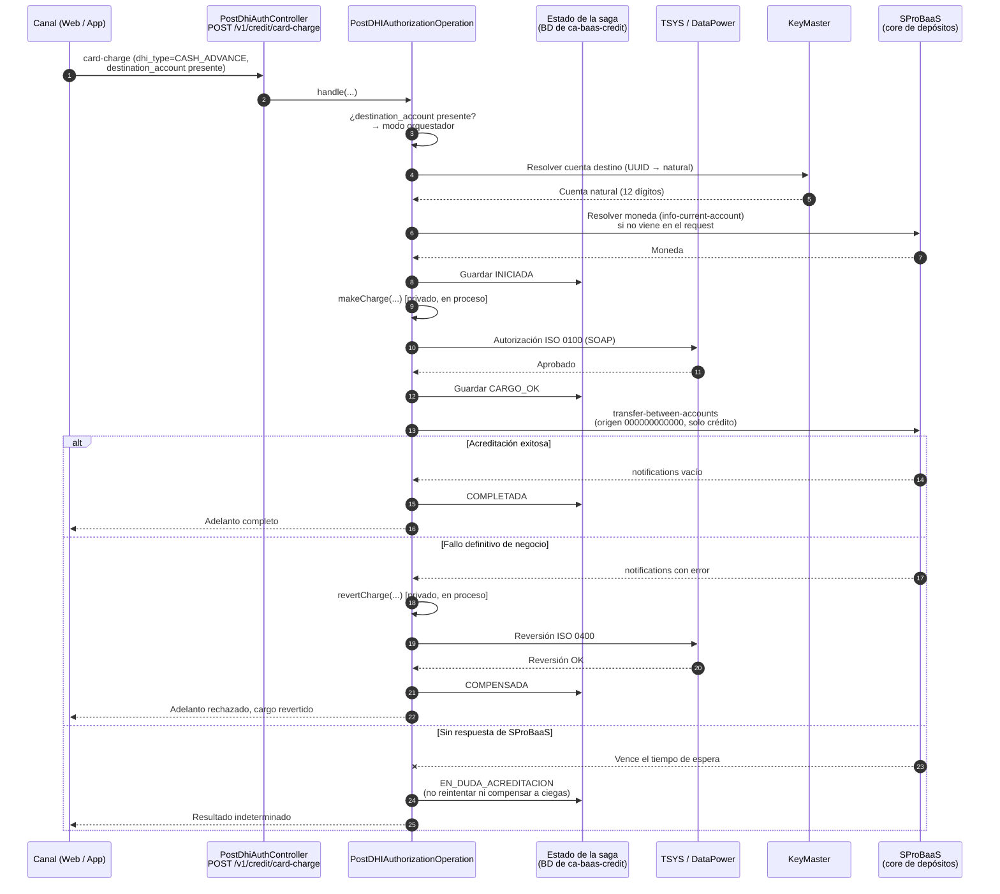
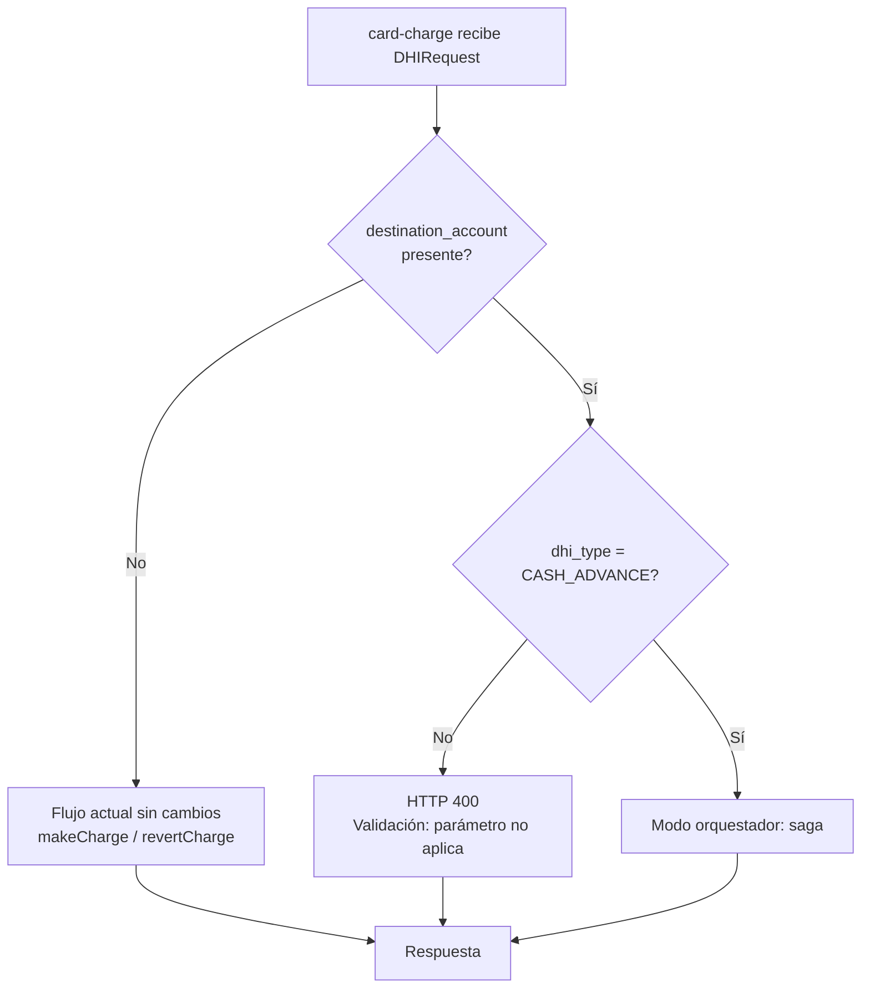
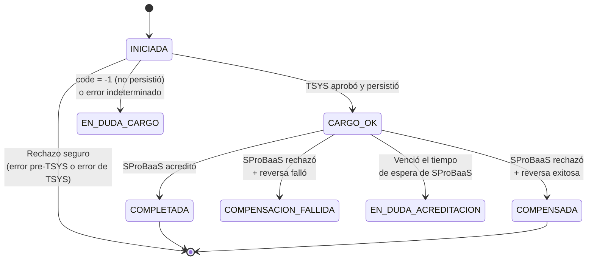

# ADR-0XX: Avance de Efectivo — orquestación dentro de `card-charge` mediante parámetro opcional de cuenta destino

**Tipo:** ADR (Registro de Decisión Arquitectónica)
**Fecha de creación:** 2026-07-08
**Última actualización:** 2026-07-09
**Autor:** Álvaro — Equipo CCA / `ca-baas-credit`
**Participantes de la decisión:** dos Tech Leads, un Arquitecto, la Gerencia
**Estado:** 🟢 **Aceptada — Opción E.** (La Opción D fue evaluada y rechazada; se conserva el registro completo abajo.)

---

## TL;DR

Se implementa el Avance de Efectivo **modificando el endpoint existente `POST /v1/credit/card-charge`**, agregando un parámetro opcional de **cuenta destino** al `DHIRequest`:

- Si `dhi_type = CASH_ADVANCE` **y** viene la cuenta destino → `PostDHIAuthorizationOperation` actúa como **orquestador**: carga la tarjeta (`makeCharge`), acredita la cuenta llamando directamente a **SProBaaS**, y compensa con `revertCharge` si la acreditación falla de forma definitiva.
- Si no viene la cuenta destino → el endpoint se comporta **exactamente como hoy**, sin cambios.

Se descartó consumir el endpoint `transfers-between-accounts` de `ca-baas-accounts` (Opción D). La razón de fondo no fue técnica sino de **riesgo de certificación cruzada** bajo una fecha crítica: ver el registro de la decisión.

## Contexto

### Del negocio

Esta funcionalidad es un **Gap** dentro de la fusión de entidades bancarias en curso: una capacidad que ofrecía la entidad absorbida y que debe existir en la plataforma resultante por obligación contractual y regulatoria.

Forma parte de un **conjunto de Gaps**. Todos los Gaps críticos y de prioridad alta deben estar **en producción antes de febrero de 2027**, fecha en la que se realiza una **auditoría**. Dentro de ese conjunto, Negocio priorizó el Avance de Efectivo con fecha propia:

| Hito | Fecha |
|------|-------|
| UAT | Primera semana de agosto de 2026 |
| **Producción** | **Fin de agosto de 2026** |
| Auditoría del conjunto de Gaps | Febrero de 2027 |

La fecha de agosto es un **compromiso de Negocio, no un límite regulatorio**; el límite regulatorio es la auditoría de febrero de 2027. Aun así, la planificación se hace contra agosto.

Se consumirá desde los canales de Plataforma Web y aplicaciones móviles.

### Del sistema

El Avance de Efectivo cruza dos dominios: **crédito** (cargo a la tarjeta, `ca-baas-credit` vía TSYS/DataPower) y **depósitos** (acreditación a la cuenta del cliente, vía el core **SProBaaS**). El microservicio `ca-baas-accounts`, administrado por otro equipo y otro negocio, ya expone `POST /v1/account/transfers-between-accounts`, que hace exactamente esa acreditación.

Se realizó un análisis de código de ambos servicios. Los hallazgos siguen siendo válidos y se conservan, porque sustentan tanto la decisión adoptada como los riesgos que quedan abiertos.

## Evidencia encontrada en el código

### En `ca-baas-credit` (`card-charge`)

| # | Hallazgo | Qué implica |
|---|----------|-------------|
| C1 | `PostDHIAuthorizationOperation` es un `@Service` cuyo único método público es `handle(RestConsumerRequest<DHIRequest>)`. `buildCommonQueryParams`, `executeDHIAuthorization`, `makeCharge` y `revertCharge` son **privados**. | La orquestación puede vivir dentro de la propia clase, invocando los métodos privados existentes. |
| C2 | `executeDHIAuthorization` despacha por `dhi_type`: `CASH_ADVANCE` → `makeCharge`; `CASH_ADVANCE_REVERSE` → `revertCharge` | El diseño original ya previó cargo y reversa como operaciones componibles. |
| C3 | `revertCharge` correlaciona la reversa con el cargo original mediante `getTransDHI(countryCode, referenceNumber, cardNumber)` y reutiliza el XML almacenado | **`reference_number` es la clave de correlación de la saga.** No hace falta persistir el Auth ID de TSYS para compensar. |
| C4 | `buildCommonQueryParams` resuelve la tarjeta con `getNaturalKeyAndExtractKeyValue(cardKey, CARD)` internamente | El PAN nunca sube al nivel de orquestación. |
| C5 | `makeCharge` y `revertCharge` reportan los fallos de negocio **dentro del cuerpo** (`result.setCode(...)` + `return resp`), no lanzando excepción | Interpretar el cuerpo ya es el patrón de la casa. |
| C6 | `makeCharge` **autoriza en TSYS (línea 150) antes de persistir en `TRANSACTIONS_DHI` (línea 208)**. Si la persistencia falla, retorna `code = -1` con `"A problem has occurred saving the charge in TRANSACTIONS_DHI"`. Y `revertCharge` **exige** ese registro para revertir. | **Existe un estado donde el cargo se ejecutó en TSYS y no puede revertirse automáticamente.** Riesgo preexistente que el orquestador debe manejar explícitamente. |
| C7 | `revertCharge` **no verifica** si la transacción ya fue revertida antes de enviar la reversa a TSYS | Una compensación ejecutada dos veces envía **dos reversas ISO 0400**. Debe protegerse con el estado de la saga. |
| C8 | `transactionPaymentTypeCharge` y `currencyNumberCharge` son **campos de instancia mutables** en un `@Service` singleton. Se escriben en `convertObjectToStringXml` (líneas 370 y 438) y se leen en `makeCharge` (líneas 189 y 191), **con una llamada SOAP a TSYS de por medio**. | **Condición de carrera confirmada** (preexistente). Ver H1. |
| C9 | `convertObjectToStringXml` se ejecuta **antes** de la llamada a TSYS y lanza códigos identificables (`E422CABAASCREDIT0008`, `E400BAASCREDIT0000/0001`) | El orquestador **puede distinguir** esos fallos como "el cargo nunca ocurrió" y abortar sin compensación. |
| C10 | `ca-baas-credit` tiene **datasource propio** (SQL Server, HikariCP, JPA), con `maximumPoolSize: 20` y `leak-detection-threshold: 2000` | La tabla de estado de la saga vive aquí. Condiciona el manejo de transacciones (ver reglas de escritura). |
| C11 | **Ningún consumer utiliza actualmente el endpoint `card-charge`** (confirmado por el equipo) | Reduce el riesgo de regresión al modificarlo. También implica que el flujo `CASH_ADVANCE` **nunca ha corrido en producción**, por lo que su certificación es trabajo nuevo en cualquier escenario. |
| C12 | `ca-baas-credit` ya cuenta con un componente de manejo de **KeyMaster** (confirmado por el equipo: se comporta igual en todos los microservicios) | La resolución de la cuenta destino (UUID → llave natural) se puede hacer dentro de Credits sin dependencia nueva. |

### En `ca-baas-accounts`

| # | Hallazgo | Qué implica |
|---|----------|-------------|
| A1 | `transfers-between-accounts` está expuesto con **OAuth2 Client Credentials** y define el scope **`baas:ca:accounts:external:read`** | El consumo desde otro dominio estaba previsto en el diseño del endpoint. |
| A2 | El archivo de propiedades que consume `TransactionsGateway` contiene el código **`3D = ADELANTO TARJETA DE CREDITO`** | El microservicio de cuentas contempla el adelanto de tarjeta como tipo de transacción. |
| A3 | Existe el código de razón **`AV01`** en la tabla del core que relaciona códigos con cuentas contables, pero con **cuenta contable en 0** | El código para adelanto ya fue creado; falta amarrarlo a una cuenta contable. Aplica **igual** en la solución adoptada. |
| A4 | **No valida idempotencia**: `reference_number` no se verifica como duplicado. Dos solicitudes iguales generan **dos transferencias** en el core. | Aplica **igual** en la solución adoptada, porque el core es el mismo. |
| A5 | Responde `HTTP 200` incluso ante errores de negocio; el error viaja dentro de `notifications` | Referencia para el manejo de errores que Credits debe replicar. |
| A6 | El servicio actúa como **proxy**: resuelve cuentas (KeyMaster, UUID → natural, relleno a 12 dígitos), resuelve moneda (`SProBaaS info-current-account` si no viene), formatea el monto a 2 decimales, ejecuta la transferencia y registra auditoría | **Este es el alcance exacto de la lógica a replicar en Credits.** |

## Registro de la decisión

### Opciones evaluadas

| Opción | Descripción | Resultado |
|--------|-------------|-----------|
| **A** | Copiar la lógica de acreditación a un componente nuevo en `ca-baas-credit`, con endpoint nuevo | Superada por E |
| **B** | Endpoint orquestador en `ca-baas-accounts` | ❌ Rechazada |
| **C** | Microservicio orquestador nuevo | ❌ Rechazada |
| **D** | Endpoint nuevo en `ca-baas-credit` que consume `transfers-between-accounts` de `ca-baas-accounts` | ❌ **Rechazada** (ver abajo) |
| **E** | **Modificar `card-charge`** con un parámetro opcional de cuenta destino; la Operation orquesta y llama a SProBaaS directamente | ✅ **Aceptada** |

### Por qué se rechazó la Opción B
Invertía la dependencia: `ca-baas-accounts` tendría que conocer TSYS, tarjetas y `card-charge`, mezclando lógica de producto de crédito dentro del dominio de depósitos. Además implicaba modificar el microservicio de otro equipo.

### Por qué se rechazó la Opción C
Repositorio, pipeline, OAuth2 e infraestructura nuevos, para un plazo corto y un equipo pequeño. Sobre-ingeniería para el tamaño del problema actual.

### Por qué se rechazó la Opción D — registro completo

La Opción D consistía en que `ca-baas-credit` consumiera como cliente el endpoint `transfers-between-accounts` de `ca-baas-accounts`, sin duplicar la lógica de acreditación. Fue propuesta con la evidencia A1, A2 y A3. Los Tech Leads, el Arquitecto y la Gerencia la rechazaron por los siguientes motivos, que quedan registrados:

1. **Ausencia de uso comprobado.** Pese a la evidencia de diseño (scope `external:read`, código `3D`, código de razón `AV01`), **ningún consumer utiliza hoy ese endpoint para Avances de Efectivo**. "Diseñado para" no equivale a "probado en producción". Existe incertidumbre real de que el endpoint funcione para este escenario sin requerir modificaciones.
2. **Riesgo de certificación cruzada.** Si el endpoint requiriera modificaciones, habría que **probar y certificar dos microservicios en lugar de uno**, con dos equipos, dos Tech Leads y dos cadenas de aprobación.
3. **Criticidad de la fecha.** El feature es un Gap contractual y regulatorio de la fusión bancaria. El costo de coordinación entre organizaciones es el riesgo principal del cronograma, por encima del costo de desarrollo.
4. **Acuerdo previo entre Negocio y Arquitectura.** La definición original era modificar `card-charge` agregando el parámetro de cuenta destino. La Opción D contradecía un acuerdo ya tomado.

**Contrapunto registrado (no prevaleció, se documenta para trazabilidad):** la Opción E no elimina la dependencia de red, la reubica: Credits deja de depender de `ca-baas-accounts` pero pasa a depender de **SProBaaS**, sistema que hoy no consume. Además duplica lógica de movimiento de dinero en un segundo dominio y aumenta la superficie PCI de `ca-baas-credit`. Estos costos se aceptan conscientemente a cambio de certificar un único microservicio. Ver Consecuencias y Deuda técnica.

## Decisión adoptada — Opción E

Modificar `POST /v1/credit/card-charge` de la siguiente forma:

1. **Contrato:** agregar al `DHIRequest` un campo opcional de **cuenta destino** (`destination_account`, surrogate key UUID o llave natural). Es un campo nuevo y opcional: **compatible hacia atrás**.
2. **Comportamiento:**
   - `dhi_type = CASH_ADVANCE` **y** `destination_account` presente → modo **orquestador** (saga).
   - `destination_account` ausente → comportamiento actual, **sin cambio alguno**.
   - `destination_account` presente con cualquier otro `dhi_type` → rechazo con error de validación (`HTTP 400`).
3. **Punto único de bifurcación.** La decisión de modo se toma **en un solo lugar** (al inicio de `executeDHIAuthorization`, o en un método nuevo invocado desde ahí). No se dispersan condicionales por `makeCharge`, `revertCharge` ni `convertObjectToStringXml`. La lógica de acreditación vive en un **colaborador nuevo** (`SProBaasTransferGateway` o equivalente), inyectado en la Operation, no dentro de ella.
4. **Compensación:** ante fallo definitivo de la acreditación, se invoca `revertCharge` en proceso con el mismo `reference_number`.

> ⚠️ **Reconocimiento explícito del compromiso de diseño.** Un parámetro opcional que altera el modo de operación de un endpoint es un antipatrón conocido (*flag parameter*). Se acepta a cambio de simplicidad de despliegue y de certificación. Su daño se contiene manteniendo **una única bifurcación** y aislando la lógica nueva en un colaborador. Si el flujo crece, la migración natural es extraer un endpoint propio (`/v1/credit/cash-advance`) reutilizando el mismo colaborador. Ver Deuda técnica.

## Diagrama de la saga adoptada



> 💡 Si Confluence no renderiza Mermaid, exportar a PNG. La fuente queda como comentario para mantenimiento.

**Notas de lectura.** Los pasos 4 a 6 (resolución de cuenta y moneda) ocurren **antes** del cargo a la tarjeta, para fallar barato y no tener que compensar por datos inválidos. Los pasos hacia TSYS y hacia SProBaaS son las dos únicas llamadas remotas de dinero.

## Modo de operación bifurcado



## Registro de estado de la saga

### Ubicación
La tabla se crea en la **base de datos propia de `ca-baas-credit`** (SQL Server, C10). `TRANSACTIONS_DHI` no sirve para este propósito: registra el cargo pero **no sabe nada de la acreditación**, o sea no permite distinguir "cargué y acredité" de "cargué y no acredité".

### Esquema propuesto

| Columna | Tipo | Notas |
|---------|------|-------|
| `id` | `BIGINT IDENTITY` | Llave primaria técnica |
| `country_code` | `VARCHAR(2)` | `CR` / `PA`. Todo el flujo está particionado por país. |
| `reference_number` | `VARCHAR(9)` | Identificador de correlación de la saga. Máximo 9 dígitos (límite del campo homólogo en SProBaaS). |
| `card_key` | `VARCHAR(36)` | Surrogate key (UUID) de la tarjeta. **Nunca el PAN.** |
| `destination_account` | `VARCHAR(50)` | Cuenta destino, tal como se envía a SProBaaS. |
| `amount` | `DECIMAL(15,2)` | |
| `currency` | `VARCHAR(3)` | |
| `state` | `VARCHAR(30)` | Ver máquina de estados. |
| `last_error_code` | `VARCHAR(30)` | Código del último fallo relevante. Insumo para conciliación. |
| `created_at` / `updated_at` | `DATETIME2` | |
| `version` | `BIGINT` | **Bloqueo optimista** (`@Version` de JPA). |

**Restricción única: `(country_code, reference_number)`.** Es la misma llave con la que `revertCharge` busca en `TRANSACTIONS_DHI`, y la que da la idempotencia de entrada.

### Máquina de estados

`EN_DUDA` se desdobla en dos, porque cada uno se concilia contra un sistema distinto y con un procedimiento distinto.

| Estado | Significado | Acción |
|--------|-------------|--------|
| `INICIADA` | Solicitud aceptada; aún no se cargó la tarjeta | — |
| `CARGO_OK` | TSYS aprobó y `TRANSACTIONS_DHI` persistió | Continuar a la acreditación |
| `COMPLETADA` | Cargo y acreditación exitosos | Terminal |
| `COMPENSADA` | Acreditación falló definitivamente; el cargo fue revertido | Terminal |
| `EN_DUDA_CARGO` | TSYS pudo haber cargado, pero `TRANSACTIONS_DHI` no guardó (C6), o el resultado fue indeterminado | **Conciliar contra TSYS / GlobalTC.** No compensable automáticamente. |
| `EN_DUDA_ACREDITACION` | El cargo se ejecutó; la llamada a SProBaaS venció por tiempo de espera y no sabemos si acreditó | **Conciliar contra SProBaaS / core.** No reintentar ni compensar a ciegas. |
| `COMPENSACION_FALLIDA` | Se intentó revertir y la reversa falló | Cola muerta + conciliación manual. |



### Reglas de escritura

1. **Escritura anticipada.** Cada transición se persiste **antes** de la llamada riesgosa, no después. Si el pod muere en medio, el estado ya quedó escrito y la transacción es conciliable.
2. **Transacciones cortas: nunca un `@Transactional` que abarque la saga completa.** Cada transición es su propia transacción: abrir, escribir, commit, liberar la conexión — y *recién entonces* ejecutar la llamada remota. Con `maximumPoolSize: 20` y `leak-detection-threshold: 2000` (C10), retener una conexión durante la llamada SOAP a TSYS o la HTTP a SProBaaS dispararía alertas de fuga a los 2 segundos y agotaría el pool con pocas decenas de solicitudes concurrentes.
3. **La compensación solo se ejecuta desde `CARGO_OK`.** Nunca desde `COMPENSADA` (evita la doble reversa de C7) ni desde los estados `EN_DUDA`.
4. **Bloqueo optimista** (`@Version`) en toda transición.
5. **Idempotencia de entrada:** antes de iniciar se consulta por `(country_code, reference_number)`. Si ya existe, se devuelve el resultado registrado.

## Interpretación del resultado de `makeCharge`

Derivado de C5, C6 y C9. El orquestador **no puede** tratar cualquier error del cargo como "el cargo no ocurrió".

| Resultado | ¿Se cargó en TSYS? | Acción |
|-----------|--------------------|--------|
| `result.code = 0` (I039 = "00") | Sí | Continuar → acreditar en SProBaaS |
| `E422CABAASCREDIT0008`, `E400BAASCREDIT0000`, `E400BAASCREDIT0001` | **No** (ocurren antes de TSYS, en `convertObjectToStringXml`) | Abortar. Sin compensación. Rechazo al canal. |
| Error de TSYS (`I039 != 0`) | **No** | Abortar. Sin compensación. Rechazo al canal. |
| `result.code = -1`, `"A problem has occurred saving the charge in TRANSACTIONS_DHI"` | **Sí** | **`EN_DUDA_CARGO`.** No abortar ni compensar: `revertCharge` no encontrará el registro (C6). Conciliar. |
| `E500CABAAS0000` genérico u otra excepción no clasificada | Indeterminado | **`EN_DUDA_CARGO`.** Conciliar. |

## Manejo de errores de la acreditación (SProBaaS)

Validado contra la sección 8 del análisis técnico de `ca-baas-accounts` ("Manejo de Errores y Excepciones").

### Modelo de errores actual de `ca-baas-accounts` (referencia)

| Código | Origen | Condición | Response |
|--------|--------|-----------|----------|
| `E500CABAAS0000` | `postTransferBetweenAccountsOperation.handle()` | Excepción no controlada en el flujo principal | HTTP 500 — *default system error* |
| `E500CABAAS0002` | `SProBaasTransferBetweenAccountsConnector` | **Excepción al llamar la transferencia** | HTTP 500 — *SPROBAAS Service unavailable* |
| `E500CABAAS0002` | `SProBaasAccountConnector` | Excepción al consultar info de cuenta | HTTP 500 — *SPROBAAS Service unavailable* |
| `E500CABAAS0002` | `TransferBetweenAccountsConverterResponseV1` | SProBaaS retorna `notifications` (error de negocio) | **HTTP 200 con `notifications`** |
| `E500BAASACCOUNT0004` | Operation | Request nulo en `formData` | HTTP 500 |
| `E500BAASACCOUNT0007` | Operation | Country code faltante en el JWT | HTTP 500 |
| `E500BAASACCOUNT0011` | Operation | Channel ID faltante | HTTP 500 |
| `E500BAASACCOUNT0012` | Operation | UserContext faltante | HTTP 500 |
| `E_IWS_XXXX` | SProBaaS (core) | Errores del core bancario | HTTP 200 con `notifications` mapeadas |
| `401` / `403` | Spring Security | Token inválido / scope insuficiente | HTTP 401 / 403 |

**Flujo de propagación:**
1. Excepciones en Gateway/Connector → se capturan en `executePostTransferBetweenAccounts()` → `convertExecutionException(e)` → `RuntimeException` con formato del Chassis.
2. Excepciones en `handle()` → catch final con `convertExecutionOldExceptionNewChassis(x, E500CABAAS0000)`.
3. Errores de SProBaaS como `notifications` → **no se lanzan como excepción**, se retornan en el response con `HTTP 200`.

### 🔴 Hallazgo crítico: `E500CABAAS0002` colapsa tres situaciones incompatibles

El mismo código cubre:

| Situación | ¿Se acreditó el dinero? |
|-----------|-------------------------|
| Excepción **consultando la información de cuenta** (ocurre antes de la transferencia) | **No.** Seguro. |
| El core respondió con `notifications` (rechazo de negocio) | **No.** El core evaluó y rechazó. |
| Excepción **llamando la transferencia** | **Indeterminado.** Un rechazo de conexión significa que nunca llegó; un vencimiento del tiempo de lectura significa que pudo haberse ejecutado. |

`ca-baas-accounts` puede colapsarlos porque **no compensa nada**: reporta el error y termina. **El orquestador del Avance de Efectivo no puede.** Si Credits replicara ese modelo y tratara todo `E500CABAAS0002` como "falló, compenso", revertiría el cargo a la tarjeta en casos donde SProBaaS **sí acreditó** → el cliente se queda con el dinero y sin la deuda.

**Regla de diseño adoptada:** el código de error que Credits devuelve al canal puede mantener compatibilidad con el modelo existente, pero **la clasificación interna que decide si se compensa debe ser más fina**. No se clasifica por código de error, sino por **el tipo de excepción y el momento de la llamada**.

### Clasificación interna del orquestador (decide la compensación)

| Situación detectada | Clasificación | Acción del orquestador |
|---------------------|---------------|------------------------|
| `notifications` vacío o nulo y `data` presente | Éxito | `COMPLETADA` |
| `notifications` con `E_IWS_XXXX` (ej. `1039 - Tipo de Operacion es Invalido o Falta`), `HTTP 200` | **Rechazo definitivo del core** — no acreditó | Compensar (`revertCharge`) → `COMPENSADA` |
| Cuenta destino inexistente (notification del core) | **Rechazo definitivo** — no acreditó | Compensar → `COMPENSADA` |
| Excepción **antes** de invocar la transferencia (resolución de cuenta o de moneda) | **No acreditó** | Ocurre antes del cargo a la tarjeta → abortar. Sin compensación. |
| `ConnectException`, `UnknownHostException`, rechazo de conexión | **No llegó** — no acreditó | Compensar → `COMPENSADA` |
| `SocketTimeoutException` (vencimiento de lectura) | **Indeterminado** | `EN_DUDA_ACREDITACION`. **No reintentar ni compensar.** Conciliar. |
| `HTTP 5xx` devuelto por SProBaaS | **Indeterminado** (el servidor pudo haber procesado antes de fallar) | `EN_DUDA_ACREDITACION`. Conciliar. |
| Cualquier excepción no clasificada durante la transferencia | **Indeterminado** | `EN_DUDA_ACREDITACION`. Conciliar. |

> ⚠️ **No reintentar la acreditación de forma automática** mientras B3 no confirme que SProBaaS deduplica `reference_number`. El análisis indica que **no lo hace** (A4), por lo que un reintento produciría una segunda transferencia real.

### Namespace de códigos de error

**No copiar los códigos `E500BAASACCOUNT00XX` a `ca-baas-credit`.** Pertenecen al espacio de nombres de `ca-baas-accounts`; verlos en los logs de Credits confundiría a quien atienda un incidente. Definir códigos propios dentro del namespace de Credits para la pata de acreditación del adelanto.

### Validaciones que Credits debe hacer y que `ca-baas-accounts` no hace

Identificadas en la sección 6.4 de su análisis. Conviene no heredarlas:

- Validar el **formato del monto** antes de convertirlo (`Double.valueOf` produce `NumberFormatException` no controlada).
- Validar la **existencia de la cuenta destino** antes de ejecutar el cargo a la tarjeta.
- Validar **montos mínimos y máximos**, si el negocio los define.

**Campos obligatorios sin validación explícita en el microservicio pero exigidos por el core:** `sign_amount = "+"`, `flag_transaction = "N"`, `format` (ETF), `operation_code`. Un faltante se manifiesta como `1039` dentro de `notifications`, con `HTTP 200`.

## Consecuencias

### Positivas
- **Un solo microservicio que certificar.** Reduce coordinación entre equipos, que es el riesgo principal del cronograma.
- **Compatible hacia atrás.** El endpoint sin `destination_account` no cambia de comportamiento.
- **Riesgo de regresión bajo:** ningún consumer utiliza hoy `card-charge` (C11).
- La compensación (`revertCharge`) queda en proceso, sin salto de red.
- El PAN nunca sube al nivel de orquestación (C4).
- KeyMaster ya existe en Credits (C12).

### Negativas y compromisos aceptados
- **Antipatrón de parámetro-bandera.** Un parámetro opcional cambia el modo de operación del endpoint. Contenido con una bifurcación única y un colaborador aislado.
- **Duplicación de lógica de movimiento de dinero.** La acreditación existirá en dos dominios (`ca-baas-accounts` y `ca-baas-credit`), con riesgo de divergencia futura.
- **Dependencia de red nueva.** Credits pasa a consumir **SProBaaS**, sistema que hoy no consume. La llamada de red no se elimina: se reubica.
- **Mayor superficie PCI y de auditoría** en `ca-baas-credit`, que ahora acredita cuentas de depósito.
- **Ambigüedad del sistema de registro:** dos servicios pueden acreditar la misma cuenta.
- La clase `PostDHIAuthorizationOperation`, ya extensa (500+ líneas), crece.

### Riesgos a monitorear

| Riesgo | Mitigación |
|--------|------------|
| **Acceso de Credits a SProBaaS** (camino de red, credenciales OAuth2 y aceptación del `x-originating-appl-code` de Credits). Hoy quien llama a SProBaaS es `ca-baas-accounts`, con su propio código EPM. | **Contemplado por el equipo**, que lo estima de gestión sencilla. Se mantiene como dependencia rastreada (B4 en el plan) porque el camino crítico requiere probar contra SProBaaS real desde el 27 de julio. Confirmar por escrito antes de la semana 2. |
| **Colapso de errores en un solo código.** `E500CABAAS0002` en `ca-baas-accounts` cubre a la vez "no acreditó" e "indeterminado". | El orquestador **no clasifica por código de error**, sino por tipo de excepción y momento de la llamada. Ver Clasificación interna. Copiar el modelo de errores tal cual produciría reversas indebidas. |
| **Cargo en TSYS no revertible** (C6) | Clasificar `code = -1` con mensaje de persistencia como `EN_DUDA_CARGO`, **nunca** como fallo de cargo. Runbook. |
| **Doble acreditación** (transacción en duda + A4: el core no deduplica) | Idempotencia de entrada. **No reintentar a ciegas.** Conciliación. |
| **Doble reversa** (C7) | Compensar solo desde `CARGO_OK`, con bloqueo optimista. |
| **Agotamiento del pool de conexiones** (C10) | Transacciones cortas; nunca envolver la saga en una sola transacción. |
| **Condición de carrera H1** (C8) | Preexistente. Se agrava en percepción porque el flujo `CASH_ADVANCE` pasa a usarse de verdad. Levantar como ticket independiente. |
| **`reference_number` con significado distinto** | En SProBaaS es `string(9)`; en el request de `card-charge` es `Long`; en el **response** de `card-charge` es el Auth ID de TSYS (campo I038), que es otra cosa. Usar un único identificador de saga ≤ 9 dígitos. |
| **Reversa posterior de un adelanto ya completado** | Ver Preguntas abiertas. Hoy `CASH_ADVANCE_REVERSE` solo revierte el cargo a la tarjeta; **no debita la cuenta**. Un adelanto completado y luego revertido dejaría el dinero acreditado. |

## Deuda técnica registrada

1. **Extraer el orquestador a su propio endpoint** (`POST /v1/credit/cash-advance`), reutilizando el colaborador de acreditación. Elimina el parámetro-bandera. Disparador: cuando el flujo gane pasos, o cuando `card-charge` adquiera consumers reales.
2. **Reconsiderar la Opción D** una vez que `transfers-between-accounts` tenga uso comprobado para adelantos, o cuando el costo de mantener dos implementaciones de acreditación supere el costo de coordinación entre equipos.
3. **Corregir H1, H2 y H6** (ver Hallazgos colaterales).

## Hallazgos colaterales (fuera del alcance de esta feature)

Detectados durante el análisis. **No los introduce esta feature.** Se recomienda levantarlos como tickets independientes.

### H1 — Condición de carrera confirmada (severidad: media-alta)

`transactionPaymentTypeCharge` y `currencyNumberCharge` son campos de instancia mutables en un `@Service` singleton, usados como variables de paso entre métodos (el propio código lo comenta: `// variable para utilizar en proceso de cargo`).

Secuencia en `makeCharge`: línea 148 escribe (dentro de `convertObjectToStringXml`, líneas 370 y 438) → línea 150 llamada **SOAP a TSYS** → líneas 189 y 191 leen. Cualquier solicitud concurrente que entre durante la llamada a TSYS sobrescribe los valores.

**Efecto:** se persisten `transaction_type` y `currency_code` de otra transacción en `TRANSACTIONS_DHI`. La autorización a TSYS sale correcta (el XML ya está armado) y `revertCharge` también funciona (usa `xml_data`). El daño es de **integridad del registro contable y de reportería en GlobalTC**.

**Corrección sugerida:** moverlos a `DHIAuthorizationCommonQueryParams`, que ya se pasa entre ambos métodos.

### H2 — Cargo autorizado y no persistido (severidad: alta, preexistente)
Ver C6. `makeCharge` autoriza en TSYS antes de persistir. Si la persistencia falla, el cargo existe y no es revertible por `revertCharge`.

### H3 — `revertCharge` no es idempotente (severidad: media, preexistente)
Ver C7. No verifica `reverse_status` antes de enviar la reversa a TSYS.

### H4 — Rama silenciosa en `executeDHIAuthorization` (severidad: baja)
Si llega un `dhi_type` fuera de las seis ramas contempladas, `resp` queda en `null` y el método retorna `RestConsumerResponse.of(null)` sin error.

### H5 — Corto-circuito por `x-country-code = "CAM"`
`PostDhiAuthController` retorna `HTTP 200` vacío, sin ejecutar nada, cuando `xCountryCode` es `"CAM"`. Los valores documentados son `CR` y `PA`. Hay que aclarar qué significa `CAM`.

### H6 — Posible `NullPointerException` en `convertObjectToStringXml` (severidad: media)

```java
if (currency != null) {
    decimalsQuantity    = currency.getDecimals();
    transactionCurrency = currency.getCurrencyNumber().toString();
}
int value = Util.multiplyDecimals(decimalsQuantity);
currencyNumberCharge = currency.getCurrencyNumber();   // ← fuera del null-check (línea 370)
```

Si `getCurrencyByParam(...)` retorna `null`, se lanza `NullPointerException`. **Atenuante:** ocurre antes de la llamada a TSYS, así que es un fallo seguro.

## Dependencias externas por resolver

1. **Negocio / Core:** amarrar el código de razón `AV01` a su cuenta contable (hoy en 0), y confirmar `format` (ETF), `operation_code` y aplicabilidad de `reason_code_debit` (el origen sería la cuenta nula `000000000000`).
2. **Seguridad y Redes:** habilitar el camino de red `ca-baas-credit → SProBaaS` y las credenciales OAuth2 correspondientes.
3. **Core / SProBaaS:** confirmar si deduplica `reference_number`. El análisis indica que **no**; confirmarlo define cuán robusto debe ser el manejo de la transacción en duda.
4. **Core / SProBaaS:** confirmar que acepta `x-originating-appl-code = CaBaaSCredit` (o el código EPM que corresponda a Credits).

## Métricas de éxito

- **Cero dobles acreditaciones** en UAT y Producción.
- **Cero dobles reversas.**
- Transacciones en `EN_DUDA_CARGO` o `EN_DUDA_ACREDITACION`: idealmente cero; cada una requiere conciliación manual.
- **Cero regresiones** en el comportamiento de `card-charge` sin `destination_account`.
- Latencia extremo a extremo dentro del acuerdo de servicio definido para canales Web y móvil.

## Preguntas abiertas

1. **Reversa de un adelanto ya completado.** Si un adelanto se completó (cargo + acreditación) y luego el negocio necesita revertirlo, `CASH_ADVANCE_REVERSE` solo revierte el cargo a la tarjeta. **¿Quién debita la cuenta de depósito?** ¿Está en alcance? Si no, hay que dejarlo documentado como limitación conocida.
2. ¿Qué significa `x-country-code = "CAM"` (H5) y aplica al modo orquestador?
3. ¿Se valida la existencia de la cuenta destino con una consulta previa a SProBaaS, o se acepta el rechazo del core y se compensa?
4. ¿Qué proceso de conciliación se define para los estados `EN_DUDA_*` y `COMPENSACION_FALLIDA`?
5. ¿El campo nuevo se llama `destination_account`? ¿Acepta UUID, llave natural, o ambos?
6. ¿Se levantan H1, H2 y H6 como tickets independientes?

## Referencias

- 📄 Plan de implementación del Avance de Efectivo: [enlace manual]
- 📁 Análisis técnico de `card-charge`: [ruta en Git]
- 📁 Análisis técnico de `transfers-between-accounts`: [ruta en Git]
- 🎫 Tickets relacionados: [agregar manualmente]
