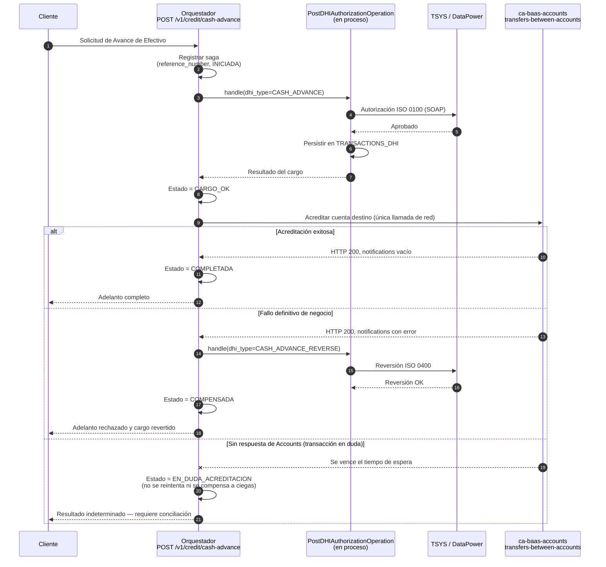
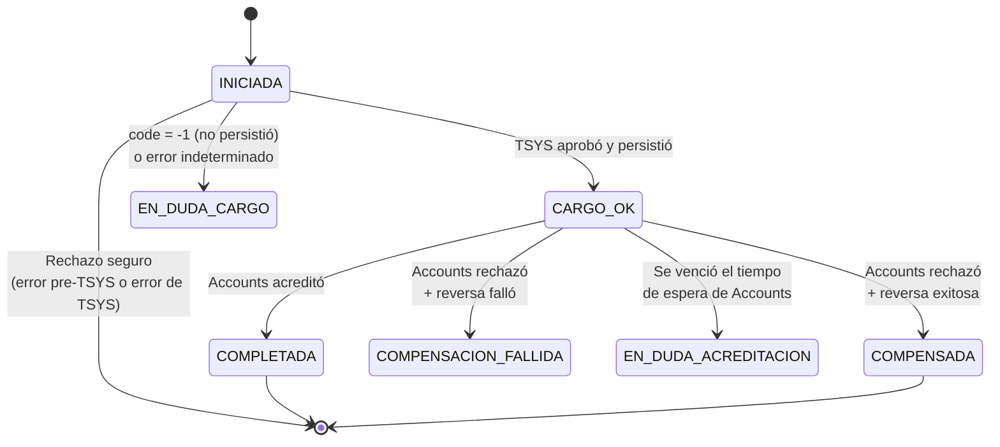

# ADR-0XX: Propuesta — Orquestar el Avance de Efectivo en `ca-baas-credit` reutilizando `transfers-between-accounts`

**Tipo:** ADR (Registro de Decisión Arquitectónica)
**Fecha:** 2026-07-08
**Autor:** Álvaro — Equipo CCA / `ca-baas-credit`
**Estado:** 🟡 Propuesta — pendiente de revisión con el Tech Lead y con el equipo de `ca-baas-accounts`

---

## TL;DR

**Propuesta:** implementar el Avance de Efectivo como un **endpoint orquestador dentro de `ca-baas-credit`** que ejecute una **saga con compensación**:

1. Invocar **en proceso** (no por REST) `PostDHIAuthorizationOperation.handle(...)` con `dhi_type = CASH_ADVANCE`, para hacer el cargo a la tarjeta.
2. Acreditar el dinero **llamando como cliente** al endpoint existente `POST /v1/account/transfers-between-accounts` de `ca-baas-accounts`, sin duplicar esa lógica.
3. Si la acreditación falla de forma definitiva, compensar invocando **en proceso** la misma operación con `dhi_type = CASH_ADVANCE_REVERSE`.

De las tres operaciones, **dos ya están construidas dentro de nuestro propio microservicio**, y **ninguna requiere modificar código existente**.

## Contexto

- El Avance de Efectivo cruza dos dominios de negocio: **crédito** (cargo a la tarjeta, `ca-baas-credit` vía TSYS) y **depósitos** (acreditación a la cuenta del cliente, `ca-baas-accounts` vía SProBaaS). Cada microservicio es administrado por un equipo y un negocio distinto.
- La solicitud inicial fue **copiar** la lógica de acreditación de `ca-baas-accounts` hacia `ca-baas-credit`, con dos objetivos válidos: (1) llegar más rápido, (2) no intervenir el microservicio del otro equipo.
- **Fecha acordada con Negocio:** UAT la primera semana de agosto 2026, Producción a fin de agosto 2026.
- Se realizó un análisis de código de ambos servicios. Los hallazgos, listados abajo, cambian el panorama.

## Evidencia encontrada en el código

### En `ca-baas-accounts`

| # | Hallazgo | Qué implica |
|---|----------|-------------|
| A1 | `transfers-between-accounts` está expuesto con **OAuth2 Client Credentials** y define el scope **`baas:ca:accounts:external:read`** | El consumo máquina-a-máquina desde otro dominio **ya estaba previsto** en el diseño del endpoint. |
| A2 | El archivo de propiedades que consume `TransactionsGateway` para transformar la respuesta contiene el código **`3D = ADELANTO TARJETA DE CREDITO`** | El microservicio de cuentas **ya contempla el adelanto de tarjeta** como tipo de transacción conocido. |
| A3 | Existe el código de razón **`AV01`** en la tabla del core que relaciona códigos con cuentas contables, pero con **cuenta contable en 0**. Confirmado con un desarrollador de SProBaaS. | El código para adelanto **ya fue creado**; falta amarrarlo a una cuenta contable. Es una configuración pendiente, no un diseño faltante. |
| A4 | **No valida idempotencia**: `reference_number` no se verifica como duplicado (sección 6.4 del análisis) | Dos solicitudes iguales generan **dos transferencias**. |
| A5 | Responde `HTTP 200` incluso ante errores de negocio; el error viaja dentro de `notifications` | El consumidor debe interpretar el cuerpo para saber si la operación funcionó. |

### En `ca-baas-credit` (`card-charge`)

| # | Hallazgo | Qué implica |
|---|----------|-------------|
| C1 | `PostDHIAuthorizationOperation` es un `@Service` cuyo único método público es `handle(RestConsumerRequest<DHIRequest>)`. `buildCommonQueryParams`, `executeDHIAuthorization`, `makeCharge` y `revertCharge` son **privados**. | El orquestador **no necesita modificar `card-charge`**: inyecta la operación y arma el `RestConsumerRequest` con el mismo mapeo que hoy hace `PostDhiAuthController`. **No hay refactor.** |
| C2 | `executeDHIAuthorization` despacha por `dhi_type`: `CASH_ADVANCE` → `makeCharge`; `CASH_ADVANCE_REVERSE` → `revertCharge` | El diseño original ya previó que un consumidor externo componga y compense estos flujos. |
| C3 | `revertCharge` correlaciona la reversa con el cargo original mediante `getTransDHI(countryCode, referenceNumber, cardNumber)` y reutiliza el XML almacenado | **`reference_number` es la clave de correlación de la saga.** No hace falta persistir el Auth ID de TSYS para compensar. |
| C4 | `buildCommonQueryParams` resuelve la tarjeta con `getNaturalKeyAndExtractKeyValue(cardKey, CARD)` internamente | El orquestador **nunca ve el PAN**: pasa el `card_key` (UUID) y KeyMaster resuelve adentro. Beneficio directo de superficie PCI. |
| C5 | `makeCharge` y `revertCharge` reportan los fallos de negocio **dentro del cuerpo** (`result.setCode(...)` + `return resp`), no lanzando excepción | **Interpretar el cuerpo ya es el patrón de la casa.** El orquestador no introduce comportamiento nuevo al leer `notifications` de Accounts; hace lo mismo que cualquier consumidor de `card-charge` debe hacer hoy. |
| C6 | `makeCharge` **autoriza en TSYS (línea 150) antes de persistir en `TRANSACTIONS_DHI` (línea 208)**. Si la persistencia falla, retorna `code = -1` con el mensaje `"A problem has occurred saving the charge in TRANSACTIONS_DHI"`. Y `revertCharge` **exige** ese registro para poder revertir. | **Existe un estado donde el cargo se ejecutó en TSYS y no puede revertirse automáticamente.** Visto desde afuera parece un error de cargo; en realidad el cliente ya fue cargado. Riesgo preexistente que el orquestador debe manejar explícitamente. |
| C7 | `revertCharge` **no verifica** si la transacción ya fue revertida antes de enviar la reversa a TSYS | Una compensación ejecutada dos veces envía **dos reversas ISO 0400**. La compensación debe estar protegida por el estado de la saga. |
| C8 | `transactionPaymentTypeCharge` y `currencyNumberCharge` son **campos de instancia mutables** en un `@Service` singleton. Se escriben en `convertObjectToStringXml` (líneas 370 y 438) y se leen en `makeCharge` (líneas 189 y 191), **con una llamada SOAP a TSYS de por medio**. | **Condición de carrera confirmada** (preexistente). Ver H1 en Hallazgos colaterales. |
| C9 | `convertObjectToStringXml` se ejecuta **antes** de la llamada a TSYS y lanza códigos de error identificables (`E422CABAASCREDIT0008`, `E400BAASCREDIT0000/0001`) | El orquestador **puede distinguir** esos fallos como "el cargo nunca ocurrió" y abortar sin compensación, en lugar de enviarlos a conciliación. |

### En la organización

| # | Hallazgo | Qué implica |
|---|----------|-------------|
| O1 | La separación de microservicios (`ca-baas-credit` / `globaltc` / `tokenization` vs. `ca-baas-accounts`) responde a una división deliberada de dominios. Confirmado con la Gerencia. | El sistema ya está dividido por dominio a propósito. |

## Decisión propuesta

Implementar el Avance de Efectivo como un **endpoint orquestador nuevo en `ca-baas-credit`** (nombre propuesto: `POST /v1/credit/cash-advance`), que componga las operaciones mediante una **saga orquestada con compensación**, consumiendo la acreditación de `ca-baas-accounts` como cliente HTTP. La propiedad de la acreditación permanece en `ca-baas-accounts`.

**Sobre cómo se invoca `card-charge`:** el cargo y la reversión **no se llaman por REST**. `card-charge` vive en el mismo microservicio, así que el orquestador inyecta `PostDHIAuthorizationOperation` y llama `handle(...)` **en proceso**. Para eso necesita construir el `RestConsumerRequest<DHIRequest>` que la operación espera, mediante un **método interno de armado del request** (el mismo mapeo que hoy hace `PostDhiAuthController`: `headerParams` + `DHIRequest` + `RestConsumerRequest.builder()`). No se trata del patrón Factory ni de ninguna abstracción adicional: es un método privado de mapeo. El controller REST es apenas un adaptador de entrada. **La única llamada de red del flujo es hacia `ca-baas-accounts`**, y esa llamada es inevitable en cualquier diseño, porque el saldo de la cuenta vive en otro sistema.

**No se modifica ninguna clase existente de `card-charge`.**

## Alternativas consideradas

### Opción A: Copiar la lógica de acreditación a `ca-baas-credit` (propuesta original)
- ✅ Evita la coordinación con el otro equipo.
- ✅ Aparenta ser el camino más corto.
- ❌ Duplica **lógica de movimiento de dinero** en un segundo dominio: dos escritores del estado de cuenta y ambigüedad sobre cuál es el sistema de registro para auditoría.
- ❌ **No elimina la llamada de red.** Credits tendría que hablar con SProBaaS (hoy solo habla con TSYS/DataPower), obtener OAuth2 contra SProBaaS y acceder a KeyMaster. La llamada existe igual, solo cambia de destino.
- ❌ Obliga a **re-certificar lógica de movimiento de dinero** (PCI + pruebas), costo que no aparece en la estimación inicial.
- 🤔 **Por qué no se propone:** el ahorro de tiempo no se sostiene al ver el costo completo, y contradice un patrón que nuestro propio `card-charge` ya implementa (C2).

### Opción B: Endpoint orquestador en `ca-baas-accounts`
- ✅ La acreditación se queda en su dueño natural.
- ❌ **Invierte la dependencia:** Accounts tendría que conocer TSYS, tarjetas y `card-charge`, mezclando lógica de producto de crédito dentro del dominio de depósitos.
- ❌ Es el microservicio del otro equipo; implica más coordinación, no menos.
- 🤔 **Por qué no se propone:** el Avance de Efectivo es un producto de crédito; su orquestador pertenece al dominio de crédito.

### Opción C: Microservicio orquestador nuevo
- ✅ Separación total de responsabilidades; la opción más limpia a largo plazo.
- ❌ Repositorio, pipeline, OAuth2 e infraestructura nuevos, para un plazo de 3 a 4 semanas y un equipo pequeño.
- ❌ Perdería la ventaja de invocar `card-charge` en proceso: la compensación pasaría a ser una llamada de red.
- 🤔 **Por qué no se propone ahora:** el camino sano es que nazca como endpoint dentro de `ca-baas-credit` y se extraiga después, si el flujo crece.

### Opción D: Endpoint orquestador en `ca-baas-credit` reutilizando `transfers-between-accounts` — **PROPUESTA**
- ✅ **No duplica** lógica de movimiento de dinero; cada dominio conserva su sistema de registro.
- ✅ **No requiere cambios de código** ni en `ca-baas-accounts` ni en `card-charge` (C1).
- ✅ La **compensación queda completamente en casa**: `CASH_ADVANCE_REVERSE` es nuestro y se invoca en proceso, sin salto de red.
- ✅ **El orquestador nunca ve el PAN** (C4): menor superficie PCI.
- ✅ Dos de las tres operaciones ya están construidas.
- ❌ Introduce una **dependencia de ejecución** nueva `ca-baas-credit → ca-baas-accounts`: una llamada HTTP adicional, con su latencia, y la disponibilidad del adelanto queda atada a la disponibilidad de Accounts.
- ❌ Requiere manejar de forma explícita la **transacción en duda** y el caso no compensable (C6).
- ✔️ **Por qué se propone:** respeta la división de dominios existente, minimiza el trabajo nuevo, y ambos servicios ya fueron diseñados para este tipo de composición.

## Diagrama de la saga propuesta



> 💡 Si esta instancia de Confluence no renderiza Mermaid, exportar el diagrama a PNG. La fuente queda como comentario para mantenimiento futuro.

**Lo que el diagrama no dice y conviene subrayar:** los pasos 3 a 7 ocurren **dentro del mismo microservicio**, sin salir a la red. El único salto de red es el paso 9. La rama de **transacción en duda** es la que protege el dinero: como la acreditación no es idempotente del lado de Accounts (A4), un tiempo de espera vencido **no permite reintentar ni compensar automáticamente**, porque no sabemos si la plata entró o no.

## Interpretación del resultado de `card-charge` (crítico)

Derivado de C5, C6 y C9. El orquestador **no puede** tratar cualquier error de `card-charge` como "el cargo no ocurrió".

| Resultado | ¿Se cargó en TSYS? | Acción del orquestador |
|-----------|--------------------|------------------------|
| `result.code = 0` (I039 = "00", `code_dhi` = "00") | Sí | Continuar → acreditar en Accounts |
| Errores de validación previa: `E422CABAASCREDIT0008`, `E400BAASCREDIT0000`, `E400BAASCREDIT0001` | **No** (ocurren antes de TSYS, en `convertObjectToStringXml`) | Abortar. Sin compensación. Devolver rechazo al cliente. |
| Error de TSYS (`I039 != 0`) | **No** | Abortar. Sin compensación. Devolver rechazo al cliente. |
| `result.code = -1`, `"A problem has occurred saving the charge in TRANSACTIONS_DHI"` | **Sí** | **`EN_DUDA_CARGO`.** No abortar ni compensar: `revertCharge` no encontrará el registro (C6). Conciliar contra TSYS / GlobalTC. |
| `E500CABAAS0000` genérico u otra excepción no clasificada | Indeterminado | **`EN_DUDA_CARGO`.** Conciliación. |

Esta tabla es, por sí sola, la justificación del registro de estado de la saga.

## Registro de estado de la saga

### Ubicación de la tabla — resuelta

`TRANSACTIONS_DHI` **no reside en la base de datos de `ca-baas-credit`**. `card-charge` la accede vía `dhiGateway.postTransDhi(...)` y `dhiGateway.getTransDHI(...)`, que retornan `ResponsePostDHI` / `ResponseGetDHI` — es decir, a través de un gateway hacia `ca-baas-globaltc`, no mediante un repositorio local.

Se verificó el `application.yml` de `ca-baas-credit`: **el microservicio ya tiene un datasource propio configurado** (SQL Server, `SQLServerDriver` + `SQLServerDialect`), con HikariCP y JPA/Hibernate operativos. Por lo tanto:

| Opción | Evaluación |
|--------|-----------|
| **A. Base de datos propia de `ca-baas-credit`** | ✅ **Adoptada.** El datasource ya existe. El estado de la saga es responsabilidad del orquestador, que vive en Credits. Sin dependencias nuevas ni saltos de red adicionales. |
| **B. Tabla nueva en GlobalTC, expuesta por `ca-baas-globaltc`** | ❌ Descartada. Agregaría un salto de red **dentro** del camino crítico de la saga, justo donde se necesita no perder el rastro, y obligaría a cambiar un microservicio más. |
| **C. Reutilizar `TRANSACTIONS_DHI`** | ❌ Descartada. Registra el cargo pero **no sabe nada de la acreditación en Accounts**: no permite distinguir "cargué y acredité" de "cargué y no acredité". |

La tabla se crea en la base de datos de `ca-baas-credit`, con DDL de SQL Server.

### Esquema propuesto

Tabla mínima. No duplica información que ya vive en `TRANSACTIONS_DHI`.

| Columna | Tipo | Notas |
|---------|------|-------|
| `id` | número | Llave primaria técnica |
| `country_code` | `VARCHAR(2)` | `CR` / `PA`. Todo el flujo de `card-charge` está particionado por país. |
| `reference_number` | `VARCHAR(9)` | Identificador de correlación de la saga. Máximo 9 dígitos (límite del `string(9)` de Accounts). |
| `card_key` | `VARCHAR(36)` | Surrogate key (UUID) de la tarjeta. **Nunca el PAN.** |
| `destination_account` | `VARCHAR(50)` | Cuenta destino del abono, tal como se envía a Accounts. |
| `amount` | `DECIMAL` | |
| `currency` | `VARCHAR(3)` | |
| `state` | `VARCHAR(30)` | Ver máquina de estados. |
| `last_error_code` | `VARCHAR(30)` | Código del último fallo relevante (`E500CABAAS0000`, `E_IWS_XXXX`, etc.). Insumo para conciliación. |
| `created_at` / `updated_at` | `TIMESTAMP` | |
| `version` | número | **Bloqueo optimista.** Evita que dos hilos compensen la misma saga. |

**Restricción única: `(country_code, reference_number)`.** No `reference_number` solo. Es la misma llave con la que `revertCharge` busca en `TRANSACTIONS_DHI` (`getTransDHI(countryCode, referenceNumber, cardNumber)`), y es también lo que da la idempotencia de entrada del orquestador.

### Máquina de estados

**`EN_DUDA` se desdobla en dos estados**, porque cada uno se concilia contra un sistema distinto y con un procedimiento distinto:

| Estado | Significado | Acción |
|--------|-------------|--------|
| `INICIADA` | Solicitud aceptada; aún no se cargó la tarjeta | — |
| `CARGO_OK` | TSYS aprobó y `TRANSACTIONS_DHI` persistió | Continuar a la acreditación |
| `COMPLETADA` | Cargo y acreditación exitosos | Terminal |
| `COMPENSADA` | Acreditación falló de forma definitiva; el cargo fue revertido | Terminal |
| `EN_DUDA_CARGO` | TSYS pudo haber cargado, pero `TRANSACTIONS_DHI` no guardó (C6) o el resultado fue indeterminado | **Conciliar contra TSYS / GlobalTC.** No compensable automáticamente: `revertCharge` no encontrará el registro. |
| `EN_DUDA_ACREDITACION` | El cargo se ejecutó; la llamada a Accounts venció por tiempo de espera y no sabemos si acreditó | **Conciliar contra SProBaaS / core.** No reintentar ni compensar a ciegas. |
| `COMPENSACION_FALLIDA` | Se intentó revertir y la reversa falló | Cola muerta + conciliación manual. No reintentar automáticamente. |



> 💡 Si Confluence no renderiza Mermaid, exportar a PNG.

### Reglas de escritura

1. **Escritura anticipada.** Cada transición se persiste **antes** de la llamada riesgosa, no después. `INICIADA` se guarda antes de invocar `card-charge`; `CARGO_OK` se guarda antes de llamar a Accounts. Si el pod muere en medio, el estado ya quedó escrito y la transacción es conciliable. Guardar después dejaría exactamente el hueco que esta tabla existe para cerrar.
2. **Transacciones cortas: nunca un `@Transactional` que abarque la saga completa.** Cada transición es su propia transacción: abrir, escribir, hacer commit, liberar la conexión — y *recién entonces* ejecutar la llamada remota. La configuración actual de `ca-baas-credit` es `maximumPoolSize: 20`, `connectionTimeout: 5000` y `leak-detection-threshold: 2000`. Retener una conexión mientras se espera la respuesta de TSYS (SOAP) o de Accounts (HTTP) dispararía las alertas de fuga a los 2 segundos y agotaría el pool con pocas decenas de solicitudes concurrentes. El servicio se degradaría por sí mismo, sin culpa de los sistemas externos.
3. **La compensación solo se ejecuta desde `CARGO_OK`.** Nunca desde `COMPENSADA` (evita la doble reversa de C7/H3) ni desde ninguno de los dos estados `EN_DUDA`.
4. **Bloqueo optimista** (`version`, vía `@Version` de JPA) en toda transición, para que dos hilos no compensen la misma saga.
5. **Idempotencia de entrada:** antes de iniciar, se consulta por `(country_code, reference_number)`. Si ya existe, se devuelve el resultado registrado en lugar de ejecutar de nuevo.

## Alcance técnico propuesto (y lo que se deja por fuera)

Esta sección recoge las observaciones del Tech Lead y define un alcance deliberadamente conservador.

| Elemento | ¿Se incluye? | Justificación |
|----------|--------------|---------------|
| **Registro de estado de la saga** (tabla mínima: `reference_number` + estado) | ✅ Sí | Tres razones concretas, ninguna teórica: (1) el caso C6 produce cargos que existen en TSYS y no pueden revertirse — hay que dejar rastro para conciliar; (2) `revertCharge` no es idempotente (C7), así que la compensación debe protegerse contra doble ejecución; (3) `TRANSACTIONS_DHI` registra el cargo pero **no sabe nada de la acreditación en Accounts**, o sea no puede distinguir "cargué y acredité" de "cargué y no acredité". |
| **Validación de idempotencia por `reference_number`** | ✅ Sí | Sale prácticamente gratis del registro anterior (una consulta antes de iniciar). **Aclaración honesta:** no resuelve por completo la transacción en duda; si la llamada a Accounts llegó y se perdió la respuesta, el registro no lo sabe. Eso se cierra con conciliación. |
| **Tiempo de espera (timeout) explícito en la llamada a Accounts** | ✅ Sí | Dos líneas de configuración. Sin él, una respuesta colgada de Accounts agota el pool de hilos de Credits. Corresponde al Riesgo #5 identificado en el propio análisis de Accounts. |
| **Interpretación de `notifications` en la respuesta de Accounts** | ✅ Sí, mínima | **No es comportamiento nuevo:** `makeCharge` y `revertCharge` ya reportan fallos de negocio dentro del cuerpo (C5). El orquestador hace lo mismo que cualquier consumidor de `card-charge` debe hacer. Se implementa como un método puntual, no como una capa. |
| **Capa anti-corrupción formal** | ❌ No | Observación válida del Tech Lead: los endpoints hermanos no la tienen, introducirla genera inconsistencia, y parte del manejo podría estar resuelto aguas abajo (SProBaaS → IWS). Para un solo consumidor y un solo endpoint, es sobre-ingeniería. |
| **Circuit breaker (Resilience4j)** | ❌ No en esta entrega | Se difiere a una fase posterior. Se documenta como riesgo asumido, para no introducir comportamiento nuevo ante QA bajo la fecha acordada. |
| **Modificaciones a `card-charge`** | ❌ Ninguna | C1 confirma que no hacen falta. |

## Hallazgos colaterales (fuera del alcance de esta feature)

Se detectaron durante el análisis y se recomienda levantarlos como tickets independientes. **No los introduce esta feature**, pero conviene registrarlos.

### H1 — Condición de carrera confirmada en `PostDHIAuthorizationOperation` (severidad: media-alta)

`transactionPaymentTypeCharge` (String) y `currencyNumberCharge` (Integer) son **campos de instancia mutables** en un `@Service` singleton de Spring, usados como variables de paso entre métodos. El propio código lo documenta: `// variable para utilizar en proceso de cargo`.

**Secuencia del problema, en `makeCharge`:**

1. Línea 148 → `convertObjectToStringXml(...)` **escribe** los campos (líneas 370 y 438).
2. Línea 150 → llamada **SOAP a TSYS** (cientos de milisegundos).
3. Líneas 189 y 191 → `makeCharge` **lee** los campos para construir el registro de `TRANSACTIONS_DHI`.

Cualquier solicitud concurrente que entre a la operación durante el paso 2 sobrescribe los valores antes de que el paso 3 los lea.

**Efecto:** se persisten `transaction_type` y `currency_code` de **otra transacción**. Un `CASH_ADVANCE` en colones puede quedar registrado con la moneda de un `BILL_PAYMENT` en dólares que corrió en paralelo.

**Alcance real:** el XML enviado a TSYS ya está construido, así que **la autorización sale correcta**; y `revertCharge` reutiliza `xml_data`, que también es correcto. El daño es de **integridad del registro contable y de reportería en GlobalTC**, no de dinero mal cargado.

**Corrección sugerida:** moverlos a `DHIAuthorizationCommonQueryParams`, que ya se pasa entre ambos métodos y existe exactamente con ese propósito. Cambio acotado.

### H6 — Posible `NullPointerException` en `convertObjectToStringXml` (severidad: media)

En la línea 370:

```java
if (currency != null) {
    decimalsQuantity   = currency.getDecimals();
    transactionCurrency = currency.getCurrencyNumber().toString();
}
int value = Util.multiplyDecimals(decimalsQuantity);
currencyNumberCharge = currency.getCurrencyNumber();   // ← fuera del null-check
```

La línea 370 desreferencia `currency` **sin la protección del `if`** de la línea 365. Si `dhiGateway.getCurrencyByParam(...)` retorna `null` (moneda no parametrizada en GlobalTC), se lanza `NullPointerException`.

**Atenuante:** ocurre **antes** de la llamada a TSYS, así que es un fallo seguro, sin dinero movido. Se manifiesta como `E500CABAAS0000` genérico.

### H2 — Cargo autorizado y no persistido (severidad: alta, preexistente)

Descrito en C6. `makeCharge` autoriza en TSYS antes de persistir. Si la persistencia falla, el cargo existe y no es revertible por `revertCharge`. Merece evaluación por parte del equipo, independientemente del Avance de Efectivo.

### H3 — `revertCharge` no es idempotente (severidad: media, preexistente)

Descrito en C7. No verifica `reverse_status` antes de enviar la reversa. En el flujo actual, el consumidor decide cuándo revertir; en el flujo del adelanto, lo protege el registro de saga.

### H4 — Rama silenciosa en `executeDHIAuthorization` (severidad: baja)

Si llega un `dhi_type` fuera de las seis ramas contempladas (por ejemplo `CONFIRMATION_MSG`), `resp` queda en `null` y el método retorna `RestConsumerResponse.of(null)` sin error. No afecta al orquestador, que siempre envía tipos válidos.

### H5 — Corto-circuito por `x-country-code = "CAM"`

`PostDhiAuthController` retorna `HTTP 200` vacío, sin ejecutar nada, cuando `xCountryCode` es `"CAM"`. Los valores documentados del header son `CR` y `PA`. **Hay que aclarar qué significa `CAM`** y decidir si el orquestador debe replicar esa validación (no puede heredarla, porque no pasa por el controller).

## Consecuencias

### Positivas
- Un solo sistema de registro por dominio; cero duplicación de lógica de posteo contable.
- La compensación no depende del otro equipo ni de una llamada de red.
- El orquestador nunca maneja el PAN.
- Cero modificaciones a código existente y en producción.
- Se reutiliza infraestructura de autorización ya existente (`baas:ca:accounts:external:read`).

### Negativas y compromisos aceptados
- Una llamada HTTP adicional en el flujo del adelanto (latencia y disponibilidad acopladas a Accounts).
- Complejidad adicional para manejar la transacción en duda y el caso no compensable.
- Sin circuit breaker en la primera entrega.

### Riesgos a monitorear

| Riesgo | Mitigación propuesta |
|--------|----------------------|
| **Cargo en TSYS no revertible** (C6 / H2) | Detectar el `code = -1` con mensaje de persistencia y clasificarlo como `EN_DUDA`, **nunca** como fallo de cargo. Runbook de conciliación. |
| **Doble acreditación** (transacción en duda + A4) | Idempotencia de entrada en el orquestador. **No reintentar a ciegas** la acreditación. Estado `EN_DUDA` y conciliación antes de reintentar o compensar. |
| **Doble reversa** (C7 / H3) | Compensar solo si el estado de la saga lo permite; nunca desde estado `COMPENSADA`. |
| **`reference_number` con tipo y significado distintos entre servicios** | En Accounts es `string(9)`; en el request de `card-charge` es `Long`; y en el **response** de `card-charge` el `reference_number` es el Auth ID Code de TSYS (campo I038), que **es otra cosa**. Usar un único identificador de correlación de la saga, de máximo 9 dígitos, y no confundirlo con el Auth ID. |
| **Accounts no valida que la cuenta destino exista antes de ejecutar** | Resolver y validar la cuenta destino **antes** del cargo a la tarjeta, para fallar barato y minimizar compensaciones. |
| **Campos obligatorios sin validación explícita en Accounts** | El core los exige aunque el microservicio no los valide. Enviarlos siempre (`sign_amount="+"`, `flag_transaction="N"`, `format`, `operation_code`). Un faltante se manifiesta como `1039` dentro de `notifications`, con `HTTP 200`. |
| **`UserContext` no poblado al invocar en proceso** | `buildCommonQueryParams` usa `getUserContext()` sin argumentos (probable `ThreadLocal` del Chassis). Verificar que esté disponible en el hilo del orquestador; si no, poblarlo explícitamente. |
| **Agotamiento del pool de conexiones** | `maximumPoolSize: 20` y `leak-detection-threshold: 2000` en `ca-baas-credit`. Prohibido envolver la saga en una sola transacción: cada transición es una transacción corta, y la conexión se libera antes de cada llamada remota. |
| **Riesgo heredado:** `ca-baas-accounts → SProBaaS` sin circuit breaker ni tiempo de espera explícito | No es nuestro para corregir, pero afecta la confiabilidad del endpoint del que dependemos. Riesgo asumido. |

## Dependencias externas por resolver

1. **Negocio / Core:** amarrar el código de razón **`AV01`** a su cuenta contable (hoy está en 0), y confirmar el `format` (ETF) y el `operation_code` del Avance de Efectivo. Confirmar si `reason_code_debit` aplica, dado que el origen sería la cuenta nula `000000000000`.
2. **Seguridad (Passport) y Redes:** otorgar el scope `baas:ca:accounts:external:read` al client de `ca-baas-credit`, y habilitar el camino de red `ca-baas-credit → ca-baas-accounts`.
3. **Core:** confirmar formalmente si SProBaaS deduplica `reference_number`. El análisis indica que no; confirmarlo define qué tan robusto debe ser el manejo de la transacción en duda.

## Métricas de éxito

- **Cero dobles acreditaciones** en UAT y en Producción.
- **Cero dobles reversas.**
- Cantidad de transacciones en estado `EN_DUDA`: idealmente cero; cada una requiere conciliación manual.
- Tasa de compensaciones dentro de lo esperado; un pico indica investigar Accounts o el core.
- Latencia extremo a extremo del adelanto dentro del acuerdo de servicio definido.

## Si la decisión se revisa en el futuro

**Disparadores para revisitar:**
- El flujo de adelanto gana pasos o complejidad → extraer el orquestador a su propio microservicio (Opción C).
- `ca-baas-accounts` publica idempotencia nativa sobre `reference_number` → simplificar el manejo de la transacción en duda.
- Se corrige H2 (cargo no persistido) → simplificar el mapeo de resultados de `card-charge`.
- El camino de red `ca-baas-credit → ca-baas-accounts` no se puede habilitar a tiempo → reevaluar. Es el único escenario donde una solución táctica distinta se justificaría, y debería documentarse como deuda técnica con plan de migración.

## Referencias

- 📁 Análisis técnico de `card-charge`: [ruta en Git]
- 📁 Análisis técnico de `transfers-between-accounts`: [ruta en Git]
- 📄 Plan de implementación del Avance de Efectivo: [enlace manual]
- 🎫 Tickets relacionados: [agregar manualmente]

## Discusión

- ¿Convención de nombre para el endpoint orquestador? (propuesto: `POST /v1/credit/cash-advance`).
- ¿Qué significa `x-country-code = "CAM"` y debe el orquestador replicar esa validación? (H5)
- ¿Validamos la existencia de la cuenta destino con una consulta previa, o aceptamos el rechazo del core y compensamos?
- ¿Qué proceso de conciliación se define para las transacciones en estado `EN_DUDA`?
- ¿Se levantan H1 y H2 como tickets independientes?
