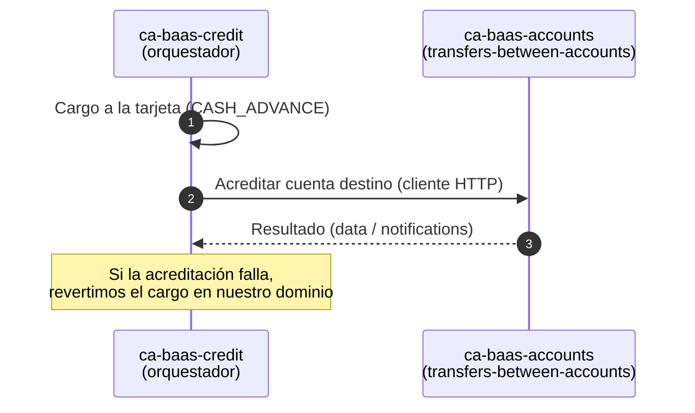

# Propuesta: consumir `transfers-between-accounts` para el Avance de Efectivo

**De:** Equipo CCA — `ca-baas-credit`
**Para:** Equipo de `ca-baas-accounts`
**Fecha:** 2026-07-08
**Estado:** 🟡 Propuesta para revisión conjunta

---

## TL;DR

Para el **Avance de Efectivo** (UAT la primera semana de agosto, Producción a fin de agosto — fechas acordadas con Negocio), `ca-baas-credit` va a orquestar el flujo y necesita **acreditar dinero a la cuenta del cliente**. En lugar de duplicar esa lógica en nuestro microservicio, proponemos **consumir su endpoint existente** `POST /v1/account/transfers-between-accounts` como cliente máquina-a-máquina.

**No les pedimos cambios de código.** El endpoint ya soporta este consumo.

## Contexto breve

El Avance de Efectivo tiene dos movimientos de dinero: el **cargo a la tarjeta de crédito** (nuestro dominio, vía `card-charge` / TSYS) y la **acreditación a la cuenta de depósito** (su dominio, vía SProBaaS).

Al analizar su servicio encontramos dos señales de que este consumo ya estaba contemplado en el diseño:

- El endpoint expone autenticación **OAuth2 Client Credentials** y define el scope **`baas:ca:accounts:external:read`**, pensado para consumidores de otros dominios.
- El archivo de propiedades que usa `TransactionsGateway` al transformar la respuesta incluye el código **`3D = ADELANTO TARJETA DE CREDITO`**, o sea que el microservicio ya reconoce el adelanto de tarjeta como tipo de transacción.

Además, con apoyo de un desarrollador de SProBaaS confirmamos que existe el código de razón **`AV01`** en la tabla que relaciona códigos con cuentas contables, aunque actualmente **su cuenta contable está en 0**.

## Qué proponemos

`ca-baas-credit` actúa como **orquestador**: hace el cargo a la tarjeta, invoca su endpoint para la acreditación y, si la acreditación falla, revierte el cargo dentro de nuestro propio dominio (`CASH_ADVANCE_REVERSE`). Su microservicio sigue siendo el **único dueño** de la acreditación a la cuenta.

> 💡 Si Confluence no renderiza Mermaid, exportar el diagrama a PNG.

## Qué necesitamos de ustedes

| # | Solicitud | Responsable sugerido |
|---|-----------|----------------------|
| 1 | Otorgar el scope **`baas:ca:accounts:external:read`** (o el que corresponda) al client de `ca-baas-credit` en Passport. | Seguridad / su equipo |
| 2 | Confirmar o habilitar el **camino de red** `ca-baas-credit → ca-baas-accounts`. | Redes / su equipo |
| 3 | **Amarrar el código de razón `AV01` a su cuenta contable** (hoy en 0), o indicarnos cuál código de razón usar para el Avance de Efectivo. | Negocio / Core |
| 4 | Confirmar el **`format` (ETF)** y el **`operation_code`** correctos para el Avance de Efectivo, y si aplica `reason_code_debit` dado que el origen sería la cuenta nula `000000000000`. | Negocio / Core |
| 5 | Confirmar si el core **deduplica `reference_number`**. Nuestro análisis indica que no; confirmarlo nos permite dimensionar bien el manejo de reintentos de nuestro lado. | Core / SProBaaS |

Los puntos 1 a 4 son **bloqueantes** para la fecha de UAT.

## Qué NO les pedimos

- **Ningún cambio de código** en su microservicio.
- Que conozcan nada de tarjetas, TSYS ni de la lógica de crédito. Esa complejidad queda de nuestro lado.
- Que manejen la compensación: la reversión del cargo es 100% de nuestro dominio.

## Por qué esta opción y no copiar la lógica

- **Un solo sistema de registro** para la acreditación a cuentas (el de ustedes). Copiar generaría dos implementaciones del mismo movimiento de dinero, con riesgo de divergencia y de auditoría (PCI).
- **Menor tiempo real de implementación de punta a punta.** Copiar nos obligaría igual a hablar con SProBaaS y KeyMaster, y a re-certificar movimiento de dinero. Reutilizar su endpoint evita esa duplicación.
- El consumo externo **ya estaba previsto** en el diseño de su endpoint.

## Fechas

| Hito | Fecha objetivo |
|------|----------------|
| Definición de scope, red y códigos de operación | Lo antes posible — **bloqueante** |
| UAT | Primera semana de agosto 2026 |
| Producción | Fin de agosto 2026 |

## Contacto

- Equipo CCA / `ca-baas-credit`: [nombre y canal]
- Análisis técnicos de `transfers-between-accounts` y `card-charge` disponibles a solicitud.
